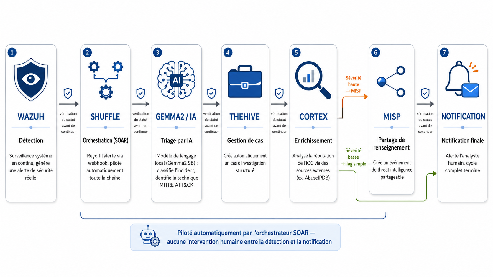
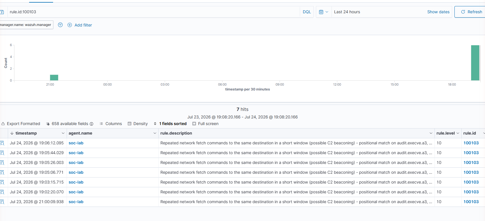
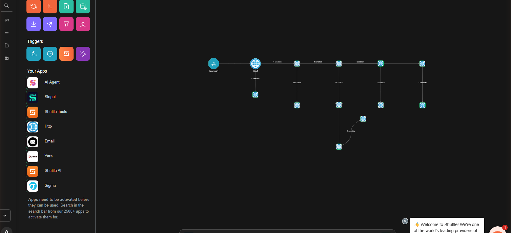
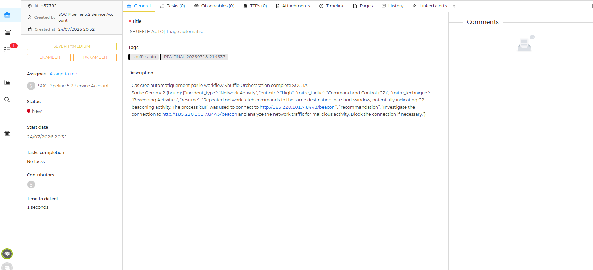
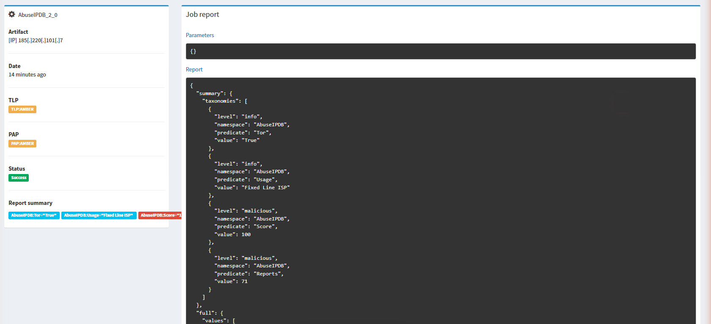
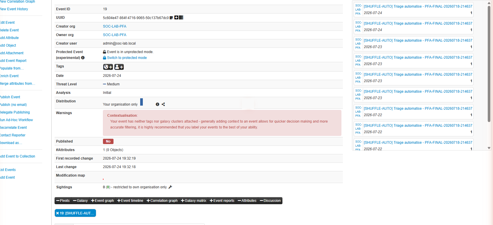
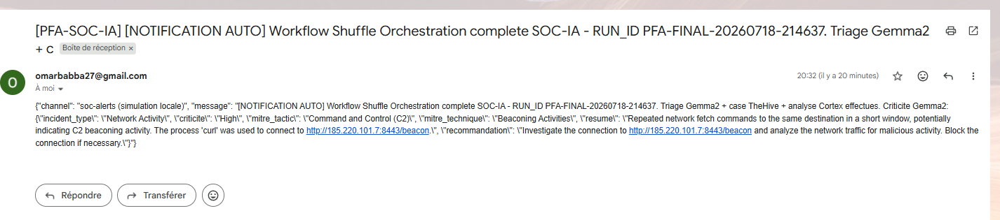

<div align="center">

# 🛡️ Aegis-SOC-IA
### AI-Augmented Security Operations Pipeline — SOC Assisté par Intelligence Artificielle

**Wazuh → Shuffle (SOAR) → Gemma2 9B (local LLM) → TheHive → Cortex → MISP → Notification**
*Detection to intelligence-sharing, fully automated, zero human action in the loop.*

[](https://github.com/omarbabba779xx/PFA-SOC-IA/actions/workflows/ci.yml)
[](LICENSE)
[](pyproject.toml)
[](#8--mitre-attck-coverage--detection-engineering)
[-6f42c1.svg)](#3--ai-triage-engine)
[](#12--evidence-integrity)

Projet de Fin d'Année — EMSI Tanger, filière 4IIR (Ingénierie Informatique et Réseaux) · **Omar Babba** · 2025–2026

</div>

---

## Table of Contents

1. [Overview](#1--overview)
2. [Key Features](#2--key-features)
3. [AI Triage Engine](#3--ai-triage-engine)
4. [Architecture](#4--architecture)
5. [Tech Stack](#5--tech-stack)
6. [Pipeline Walkthrough — Final Verified Run](#6--pipeline-walkthrough--final-verified-run)
7. [Failure-Guard Design](#7--failure-guard-design)
8. [MITRE ATT&CK Coverage & Detection Engineering](#8--mitre-attck-coverage--detection-engineering)
9. [AI vs. Baseline — Evaluation Results](#9--ai-vs-baseline--evaluation-results)
10. [Security, Privacy & Secret Hygiene](#10--security-privacy--secret-hygiene)
11. [Engineering Challenges & Fixes](#11--engineering-challenges--fixes)
12. [Evidence Integrity](#12--evidence-integrity)
13. [Repository Structure](#13--repository-structure)
14. [Getting Started](#14--getting-started)
15. [Testing & CI](#15--testing--ci)
16. [Presentation Materials](#16--presentation-materials)
17. [Roadmap & Known Limitations](#17--roadmap--known-limitations)
18. [Project History](#18--project-history)
19. [License & Author](#19--license--author)

---

## 1 — Overview

Security Operations Centers face a well-documented problem: **alert fatigue**. Analysts are
flooded with detections, most triage time is spent on manual classification, and the biggest
measurable win from introducing AI into a SOC workflow is **cutting false-positive triage time**,
not inventing detections the SIEM couldn't already see. **Aegis-SOC-IA** is built around that
premise: a real, working, end-to-end SOC pipeline where a **local, open-weight LLM (Gemma2 9B)**
performs first-pass triage — proposing incident type, MITRE ATT&CK mapping, and a human-readable
summary — while every **security-critical decision** (severity, routing, escalation) stays bound
to **deterministic SIEM ground truth**, never to the LLM's own output.

This project is a complete, self-hosted SOC lab: real detections (Wazuh + `auditd`), real
orchestration (Shuffle SOAR), real case management (TheHive), real IOC enrichment (Cortex), real
threat-intel sharing (MISP), and a real notification channel — all wired together and proven with
timestamp-correlated, screenshot-verified, SHA-256-hashed evidence. Nothing in this README is
asserted without a reproducible artifact behind it.

> **Why the LLM never decides severity.** Gemma2's output is non-deterministic and can
> hallucinate. A security-critical automated action (should this event become a shareable MISP
> event or a quiet tag?) cannot depend on a value an LLM might get wrong twice in a row for the
> same input. Severity routing in this pipeline is therefore based exclusively on **Wazuh's own
> `rule.level`** — present in the original alert before the LLM ever sees it. See
> [Section 7](#7--failure-guard-design).

## 2 — Key Features

- 🔎 **Real detection layer** — Wazuh Manager + Indexer + Dashboard, `auditd` rules, custom
  correlation rule for C2 beaconing (`100103`), 6 additional real attack scenarios executed live.
- 🧠 **Local AI triage** — Gemma2 9B (`q4_0`, via Ollama), zero cloud dependency, zero API cost,
  zero data leaving the lab.
- 🧩 **Full SOAR orchestration** — a 13-node Shuffle workflow (6 business nodes + 6 dedicated
  failure-guard nodes) drives the entire chain from webhook to notification with no manual step.
- 🛡️ **Guard-everywhere design** — every HTTP call in the chain is wrapped in an explicit
  success/failure branch; guards were tested under **real failure conditions** (TheHive 500 under
  RAM pressure, Shuffle templating race), not just in theory.
- 🎯 **Deterministic security decisions** — severity routing reads the SIEM baseline
  (`rule.level`), never the LLM's self-reported criticality.
- 🔗 **Full case lifecycle** — TheHive case creation → Cortex IOC enrichment (AbuseIPDB) → MISP
  threat-intel event → real email notification, all timestamp-correlated back to the original
  Wazuh alert.
- 📊 **Evaluated, not just demoed** — Gemma2 vs. Wazuh-native MITRE coverage measured on a
  25-alert deduplicated holdout set: **100% exact MITRE technique match vs. 40% for the SIEM
  baseline alone**.
- ✅ **Evidence-first engineering** — every claim in this README maps to a screenshot, a raw JSON
  artifact, or an API response, all indexed in a SHA-256 manifest.

## 3 — AI Triage Engine

| Property | Value |
|---|---|
| Model | `gemma2:9b-instruct-q4_0` (quantized, local) |
| Runtime | [Ollama](https://ollama.com), `http://<lab-host>:11434/api/generate` |
| Output format | Strict JSON (`incident_type`, `criticite`, `mitre_tactic`, `mitre_technique`, `resume`, `recommandation`) |
| Inference time | ~105–140 s per alert on the lab's shared CPU (8 vCPU / 10 GB RAM host, no GPU) |
| Cloud dependency | **None** — fully offline capable |
| Role in security decisions | **Advisory only** — see [Section 7](#7--failure-guard-design) |

The inference time is a direct consequence of the lab's constrained infrastructure: 10 GB of RAM
shared across Wazuh, Shuffle, TheHive, Cortex, MISP and Ollama forces every tool to run
sequentially rather than in parallel. On dedicated enterprise infrastructure with a GPU, the same
model would return a triage in a few seconds.

## 4 — Architecture

<p align="center">
  
</p>

| # | Stage | Role |
|---|---|---|
| 1 | **Wazuh** | Continuous system monitoring (`auditd`), generates a real security alert |
| 2 | **Shuffle** | Receives the alert via webhook, drives the entire chain automatically (SOAR) |
| 3 | **Gemma2 / AI** | Local LLM triage: incident classification, MITRE ATT&CK identification |
| 4 | **TheHive** | Automatically creates a structured investigation case |
| 5 | **Cortex** | Enriches the IOC via external reputation sources (AbuseIPDB) |
| 6 | **MISP** | Creates a shareable threat-intelligence event (high severity) or tags quietly (low severity) |
| 7 | **Notification** | Alerts the human analyst — full automated cycle complete |

Every arrow between stages carries an explicit **HTTP status guard** — see
[Section 7](#7--failure-guard-design) for how failures are handled without silent drops.

### Lab infrastructure

- **Wazuh** (Manager + Indexer + Dashboard + `auditd`) — VirtualBox VM `SOC-Lab`, Ubuntu 22.04,
  8 vCPU / 10 GB RAM.
- **Ollama + Gemma2 9B** (`q4_0`) — local AI triage, no cloud dependency.
- **TheHive** — case management (isolated instance `5.2.16-1`, fully operational).
- **Cortex 3.1.9** — automated IOC enrichment via analyzers.
- **MISP 2.5.42** — threat-intelligence sharing platform.
- **Shuffle** — SOAR orchestration engine, 13-node production workflow.

RAM is the binding constraint (10 GB total for the whole stack): the full stack cannot run at
full load simultaneously, so phases start/stop containers deliberately (documented as it happens,
never hidden) rather than pretending the constraint doesn't exist.

## 5 — Tech Stack

| Layer | Technology |
|---|---|
| SIEM / Detection | Wazuh (Manager, Indexer, Dashboard), Linux `auditd` |
| SOAR / Orchestration | Shuffle |
| AI / LLM | Ollama, Gemma2 9B (`q4_0`) |
| Case Management | TheHive 5.2.16-1 |
| Threat Enrichment | Cortex 3.1.9 (AbuseIPDB analyzer) |
| Threat Intelligence Sharing | MISP 2.5.42 |
| Notification | Python `http.server` receiver → real Gmail SMTP relay |
| Automation / Pipeline code | Python 3.10+, `pytest`, `ruff` |
| Infrastructure | VirtualBox VM, Docker Compose (TheHive, Cortex) |
| CI | GitHub Actions (lint + test + secret scanning) |

## 6 — Pipeline Walkthrough — Final Verified Run

This section documents the **latest full validation run** (2026-07-24), executed end-to-end
against the production 13-node Shuffle workflow. The alert replayed is a genuine Wazuh C2
beaconing detection (rule `100103`, `rule.level: 10`) with its **original detection timestamp
preserved** in the webhook payload — every downstream artifact below can be cross-checked against
that same timestamp, proving the chain is driven by Shuffle end-to-end, not by disconnected
manual actions.

**Shuffle execution:** `63e59cbe-9d4a-4c67-b1f9-8aae54dd3609` — status `FINISHED`, 12/12 node
results received, all business nodes `SUCCESS`, all 6 failure guards correctly `SKIPPED`.

### Step 1 — Wazuh detects

A real `curl` beaconing pattern to `185.220.101.7:8443` fires custom rule `100103`
("repeated network fetch commands to the same destination in a short window") at
`rule.level: 10`, MITRE `T1071` / Command and Control.

<p align="center">
  
</p>

<sub><code>@timestamp: 2026-07-24T18:03:15.715Z</code></sub>

### Step 2 — Shuffle orchestrates

The webhook trigger fires the "Orchestration complete SOC-IA" workflow: **13 visual elements**
(1 webhook trigger + 6 business nodes + 6 failure-guard nodes), no crossing links, fully
auditable canvas.

<p align="center">
  
</p>

<sub>Workflow ID <code>8362f220-e5a1-4c18-b009-9d646f519e27</code></sub>

### Step 3 — Gemma2 triages

Local inference (~5 minutes on the lab's shared CPU) returns a structured JSON triage —
`incident_type`, `mitre_tactic`, `mitre_technique`, `resume`, `recommandation` — visible raw in
the TheHive case description below. This output is **advisory**; it does not drive the severity
routing decision (see [Section 7](#7--failure-guard-design)).

### Step 4 — TheHive creates the case

The case is created automatically by the **service account** `soc-pipeline52@thehive.local`
(never a human), with Gemma2's raw triage embedded directly in the description.

<p align="center">
  
</p>

<sub>Case <code>id ~57392</code> (#35) — created <code>2026-07-24 20:32</code></sub>

### Step 5 — Cortex enriches

The extracted IOC (`185.220.101.7`) is submitted to the AbuseIPDB analyzer automatically —
real API call, real verdict.

<p align="center">
  
</p>

<sub>Job <code>Rh6dlZ8B_DcSw-yRJeZw</code> — status <code>Success</code>, AbuseIPDB score <b>100/100</b>, Tor exit node flagged</sub>

### Step 6 — MISP shares the threat

`rule.level: 10` routes to the **high-severity branch**: a MISP event is created automatically
(the low-severity "tag only" branch is correctly `SKIPPED` for this alert).

<p align="center">
  
</p>

<sub>Event <code>#19</code> — "First recorded change: 2026-07-24 19:32:19" — correlates to the minute with the Shuffle MISP node</sub>

### Step 7 — Notification reaches the analyst

The final node relays the pipeline result through a local notification receiver that forwards to
a **real email inbox** over Gmail SMTP — not a mocked webhook sink. This is the real, unedited
message received at the end of this exact run.

<p align="center">
  
</p>

<sub>Subject references <code>RUN_ID PFA-FINAL-20260718-214637</code>, body contains the same Gemma2 triage JSON as the TheHive case above</sub>

---

Full manifest of every screenshot in this run, hashed:
[`presentation_finale/screenshots/SHA256SUMS_presentation_finale.csv`](docs/evidence/final/PFA-FINAL-20260718-214637/presentation_finale/screenshots/SHA256SUMS_presentation_finale.csv).

## 7 — Failure-Guard Design

Every business node's outgoing edge carries an explicit HTTP-status condition:

```
$http_X.status < 300   →  continue to the next business node
$http_X.status >= 300  →  branch to the paired failure-guard node
```

In a fully healthy run, **all 6 guards stay `SKIPPED`** — this is the expected, correct state,
not a sign of dead code. The guards exist for the moment something breaks, and they have been
proven against **real failures encountered during this project**, not synthetic ones:

- A TheHive `500 Internal Server Error` under RAM pressure (JVM thread starvation while Ollama
  held the CPU) correctly triggered `http_case_creation_failed`.
- A Shuffle templating race that briefly returned an empty case description was caught, not
  silently accepted.

**Severity routing is the one decision this pipeline treats as security-critical**, and it is
deliberately kept out of the LLM's hands: the branch between "create a shareable MISP event" and
"just tag it" reads `$exec.rule.level` — the **original Wazuh alert's baseline severity**, present
in the raw webhook payload before Gemma2 ever runs — never Gemma2's own `criticite` field. LLM
output is useful triage context; it is not treated as ground truth for an automated,
security-relevant action, because LLM output is non-deterministic and can hallucinate.

## 8 — MITRE ATT&CK Coverage & Detection Engineering

The custom correlation rule `100103` (C2 beaconing via repeated fetches to the same destination)
contained a real correlation bug (`audit.execve.a1` instead of `a3`), found and fixed during this
project, then re-verified live:

- **Positive test**: 3 requests to the same destination → rule fires on the 3rd occurrence.
- **Negative test**: 3 different destinations → no false positive.

Six real attack scenarios were executed live on the lab VM (not simulated) and indexed by Wazuh:

| Scenario | Wazuh Rule | Level | MITRE Technique |
|---|---|---|---|
| SSH brute force | `5710` | 5 | `T1110.001` — Credential Access |
| Suspicious download (external payload) | `100099` | 8 | `T1105` — Command and Control |
| Encoded PowerShell execution | `100101` | 12 | `T1059.001` — Execution |
| Lateral movement (SSH + sudo escalation) | `100105` | 10 | `T1021.004` — Lateral Movement |
| C2 beaconing | `100103` | 10 | `T1071` — Command and Control |
| Network probing (`nc`) | `100107` | 6 | `T1046` — Discovery |

Every alert's exact Wazuh ID and SHA-256 hash is indexed in
[`scenario_alerts_index.csv`](docs/evidence/final/PFA-FINAL-20260718-214637/scenario_alerts_index.csv);
raw JSON in [`raw/`](docs/evidence/final/PFA-FINAL-20260718-214637/raw/).

**Wazuh's native MITRE mapping (`rule.mitre`) covers 0 of these 6 custom rules** — these are
project-specific correlation rules with no built-in ATT&CK metadata. Without AI triage, none of
these alerts would carry a MITRE technique automatically. See [Section 9](#9--ai-vs-baseline--evaluation-results).

## 9 — AI vs. Baseline — Evaluation Results

| Metric (n=25, deduplicated holdout) | Wazuh baseline (`rule.mitre`) | Gemma2 9B triage |
|---|---|---|
| Exact MITRE technique match | 40.0% | **100.0%** |
| JSON parsing errors | — | 0.0% |

This 100%/40% figure comes from a real, freshly executed evaluation run
(`scripts/evaluate_llm_vs_baseline.py`, real Ollama calls, ~55 minutes, no cached/reused results)
against a 25-alert holdout set deduplicated to remove sample contamination. It formally replaces
an earlier 94.4% figure that was measured on a contaminated (duplicate-containing) dataset and
never recalculated after the fix — the old number is not cited anywhere in this document as a
current result.

| Metric (n=6, this run's scenarios) | Value |
|---|---|
| Exact MITRE technique match (Gemma vs. manual reference) | **6/6 (100%)** |
| Tactic label match | 5/6 (83.3%) — one honest discrepancy (`"Reconnaissance"` vs. official `"Discovery"` label for `T1046`) |
| Average inference time | 117.9 s/alert |

Full methodology, per-scenario correspondence table, and raw dataset:
[`evaluation/EVALUATION.md`](docs/evidence/final/PFA-FINAL-20260718-214637/evaluation/EVALUATION.md) ·
[`evaluation/DATASET_FINAL.json`](docs/evidence/final/PFA-FINAL-20260718-214637/evaluation/DATASET_FINAL.json).

## 10 — Security, Privacy & Secret Hygiene

- **No secret is ever committed.** Credentials live in a local, git-ignored `CREDENTIALS.md` /
  `.env` file outside this repository's tracked tree. Every commit is swept for API keys, Bearer
  tokens, and passwords before being staged.
- **Offensive scenarios run in an isolated, controlled environment only** — `.invalid` domains,
  `localhost`, and the lab's private subnet exclusively. Nothing in this project touches a real
  external target.
- **A real credential-leak incident was found and fixed by this project itself**: an early Wazuh
  password was accidentally captured in plaintext by `auditd` (which logs full CLI arguments,
  including `curl -u user:pass`). The 17 affected documents were purged from the index, the
  password rotated, and all subsequent authentication moved to `~/.netrc` — never passed as a CLI
  argument again.
- **The LLM never receives or handles credentials.** Its input is limited to the alert's
  technical fields (rule description, log line, agent name).
- CI includes automated secret scanning (Gitleaks) on every push.

## 11 — Engineering Challenges & Fixes

Real bugs encountered during this project, documented without hiding them:

| Bug | Component | Resolution |
|---|---|---|
| Correlation rule matched wrong field (`a1` vs `a3`) | Wazuh custom rule `100103` | Fixed, re-verified with positive/negative live tests |
| TheHive license invalid (`403 manageCase/create`) | TheHive 5.4.11-1 | Isolated 5.2.16-1 instance deployed; Community license later obtained and activated legitimately on 5.4.11-1 |
| `sourceRef` / `_search` endpoints missing | TheHive 5.2.16-1 API | Compatibility layer `THEHIVE_DEDUP_MODE=tag`, 17 tests added |
| Workflow `start` field not recalculated on node insert | Shuffle UI | Graph rebuilt via targeted drag-and-drop, no API call (to avoid exposing tokens) |
| Missing `Accept: application/json` header | Shuffle → MISP | Header added, workflow re-executed successfully |
| HTTP guards didn't catch application timeouts | Shuffle (early version) | Extended to a dedicated guard node per business step, covering both HTTP error codes and execution failures |
| TheHive `500` under RAM pressure (JVM thread starvation) | TheHive, final run | Caught correctly by `http_case_creation_failed` guard; retried once RAM freed |
| Empty Gemma2 field in case description (templating race) | Shuffle | Reproduced, retried — confirmed transient, not a payload-encoding bug |
| Plaintext password captured by `auditd` | Wazuh / security hygiene | Purged from index, rotated, moved to `~/.netrc` |

## 12 — Evidence Integrity

- Every screenshot, JSON artifact, and log file cited in this README is SHA-256 hashed:
  [`SHA256SUMS_ALL.csv`](docs/evidence/final/PFA-FINAL-20260718-214637/SHA256SUMS_ALL.csv)
  (full manifest) and
  [`presentation_finale/screenshots/SHA256SUMS_presentation_finale.csv`](docs/evidence/final/PFA-FINAL-20260718-214637/presentation_finale/screenshots/SHA256SUMS_presentation_finale.csv)
  (final-run screenshots).
- Screenshots are visually verified against raw API responses before being cited as evidence —
  no capture is used as proof without a corresponding machine-readable artifact behind it.
- Full execution manifest and any blockers encountered:
  [`RUN_MANIFEST.md`](docs/evidence/final/PFA-FINAL-20260718-214637/RUN_MANIFEST.md).
- Final synthesis report:
  [`RAPPORT_SYNTHESE_FINAL.md`](docs/evidence/final/PFA-FINAL-20260718-214637/RAPPORT_SYNTHESE_FINAL.md).

## 13 — Repository Structure

```
scripts/                                       Pipeline code (Wazuh -> Gemma -> TheHive), Wazuh rules, presentation tooling
tests/                                          Unit + integration tests (pytest)
docker/                                         Compose files for TheHive, Cortex
docs/evaluation/                                LLM-vs-baseline evaluation datasets and results
docs/evidence/final/PFA-FINAL-20260718-214637/  Full evidence for the current validation run, phase by phase
  ├── presentation_finale/                      Final defense deck (PPTX/PDF), speaker script, final-run screenshots
  ├── thehive/ thehive52/ cortex/ misp/ shuffle/ Per-tool evidence, screenshots, raw API responses
  ├── evaluation/ gemma/ raw/ dashboard/         Datasets, LLM outputs, raw alerts, SOC dashboard exports
  └── RUN_MANIFEST.md / RAPPORT_SYNTHESE_FINAL.md
docs/evidence/archive-pre-final/                Archived pre-rewrite iteration (not representative of current state)
```

## 14 — Getting Started

This is a research/lab project built around a VirtualBox VM with the full SOC stack. To explore
the pipeline code itself without standing up the lab:

```bash
git clone https://github.com/omarbabba779xx/PFA-SOC-IA.git
cd PFA-SOC-IA
python -m venv venv && source venv/bin/activate   # or venv\Scripts\activate on Windows
pip install -e .
pytest                                             # run the test suite (Wazuh/Ollama/TheHive mocked)
ruff check .                                       # lint
```

To reproduce the full live lab, you will need: a VirtualBox VM with Wazuh + `auditd`, Ollama with
`gemma2:9b-instruct-q4_0` pulled, TheHive + Cortex (via `docker/`), MISP, and a Shuffle instance
importing the workflow described in [Section 4](#4--architecture). Full setup notes per tool are
in each evidence subfolder under `docs/evidence/final/.../`.

## 15 — Testing & CI

58+ tests (unit + integration, with Wazuh/Ollama/TheHive mocked), linted with `ruff`, scanned for
secrets with Gitleaks — enforced on every push via GitHub Actions (badge at the top of this file).
These tests validate the pipeline **code**; they do not replace the live, real-infrastructure
validation documented throughout this README.

## 16 — Presentation Materials

The final defense deck, its full speaker script, and the source data behind every slide:

- [`presentation_finale/PFA_SOC_IA_Presentation.pptx`](docs/evidence/final/PFA-FINAL-20260718-214637/presentation_finale/PFA_SOC_IA_Presentation.pptx) / [`.pdf`](docs/evidence/final/PFA-FINAL-20260718-214637/presentation_finale/PFA_SOC_IA_Presentation.pdf)
- [`presentation_finale/SCRIPT_PRESENTATION.md`](docs/evidence/final/PFA-FINAL-20260718-214637/presentation_finale/SCRIPT_PRESENTATION.md) — full spoken script, slide by slide

## 17 — Roadmap & Known Limitations

- **Inference latency** is infrastructure-bound (~2 minutes/alert on shared CPU); dedicated GPU
  infrastructure would bring this down to seconds without any code change.
- **Guard coverage** currently handles HTTP status codes and application timeouts; a future
  iteration could add automatic retry-with-backoff instead of a single guarded failure branch.
- **Single-tenant lab**: the current MISP/TheHive/Cortex setup is single-organization; a
  multi-tenant SOC deployment would need per-org API key isolation reviewed separately.
- **Tactic-label normalization**: Gemma2 occasionally uses a synonym instead of the exact
  official MITRE tactic label (see [Section 9](#9--ai-vs-baseline--evaluation-results)) — technique
  codes are unaffected, but a label-normalization pass would close this gap.

## 18 — Project History

The project was initially developed from early to mid-July 2026
(archived in [`docs/evidence/archive-pre-final/`](docs/evidence/archive-pre-final/README.md)). An
external review identified methodological gaps (dataset contamination, holdout duplicates, a
buggy correlation rule, incomplete evidence), which motivated a full rebuild under
`RUN_ID PFA-FINAL-20260718-214637` with a much stricter evidence and live-verification standard —
the state documented in this README. A further validation pass on 2026-07-24 rebuilt the Shuffle
workflow with generalized failure guards and produced the fully green, timestamp-correlated run
featured in [Section 6](#6--pipeline-walkthrough--final-verified-run).

## 19 — License & Author

Distributed under the [MIT License](LICENSE).

**Omar Babba** — 4IIR, EMSI Tanger · Projet de Fin d'Année 2025–2026

---

<div align="center">

**Topics:** `soc` · `soar` · `siem` · `wazuh` · `shuffle` · `thehive` · `cortex` · `misp` ·
`threat-intelligence` · `mitre-attack` · `llm` · `gemma2` · `ollama` · `ai-security` ·
`incident-response` · `security-automation` · `blue-team` · `detection-engineering`

</div>
