# SOC Assisté par Intelligence Artificielle

**Projet de Fin d'Année (PFA) — 4ème année Informatique et Réseaux / Cybersécurité (4IIR)**
**EMSI Tanger — 2025-2026**
**Auteur : Omar Babba**

Conception et déploiement d'une maquette de plateforme SOC (Security Operations Center) assistée par un LLM local, couvrant la détection, le triage assisté par IA, l'enrichissement des observables, la gestion des incidents et l'orchestration automatisée de la réponse.

---

## Sommaire

1. [Contexte et problématique](#contexte-et-problématique)
2. [Architecture](#architecture)
3. [Preuve de bout en bout — la chaîne complète sur des alertes réelles](#preuve-de-bout-en-bout--la-chaîne-complète-sur-des-alertes-réelles)
4. [Parcours expérimental — évaluer le LLM face à une baseline à règles](#parcours-expérimental--évaluer-le-llm-face-à-une-baseline-à-règles)
5. [Détection avancée au niveau commande (auditd)](#détection-avancée-au-niveau-commande-auditd)
6. [Changement de modèle : Mistral 7B → Gemma2 9B](#changement-de-modèle--mistral-7b--gemma2-9b)
7. [Enrichissement et Threat Intelligence (Cortex, MISP)](#enrichissement-et-threat-intelligence-cortex-misp)
8. [Orchestration et réponse automatisée (Shuffle SOAR)](#orchestration-et-réponse-automatisée-shuffle-soar)
9. [Dashboard SOC personnalisé](#dashboard-soc-personnalisé)
10. [Bugs et incidents réels — récapitulatif complet](#bugs-et-incidents-réels--récapitulatif-complet)
11. [Limites d'infrastructure](#limites-dinfrastructure)
12. [Reproduire l'environnement](#reproduire-lenvironnement)
13. [État d'avancement et planning](#état-davancement-et-planning)
14. [Valeur professionnelle](#valeur-professionnelle)

---

## Contexte et problématique

Dans un SOC moderne, les analystes doivent traiter un volume important d'alertes provenant de multiples sources. Le triage manuel devient rapidement lent, répétitif et difficile à maintenir avec un niveau de qualité constant.

Ce projet ne vise pas à remplacer l'analyste ni à construire un SOC de production complet, mais à répondre à une question mesurable :

> **Quelle est la valeur ajoutée d'un LLM local dans le triage des alertes SOC par rapport à une approche classique basée sur des règles de corrélation, en termes de temps de traitement, qualité de classification, mapping MITRE ATT&CK, réduction des faux positifs et aide à la décision ?**

Toute la démarche de ce document suit un principe simple, répété à chaque étape : **mesurer, diagnostiquer les causes d'écart, corriger, re-mesurer** — et documenter honnêtement ce qui fonctionne, ce qui ne fonctionne pas encore, et ce qui a été cassé puis réparé en cours de route.

## Architecture

| Couche | Outil | Rôle |
|---|---|---|
| Détection | Wazuh Agent + Manager (+ `auditd`) | Collecte des logs, détection comportementale et au niveau commande, génération d'alertes |
| Centralisation | Wazuh Indexer + Dashboard | Indexation, recherche, visualisation, métriques SOC |
| Assistant IA | Ollama + **Gemma2 9B instruct (q4_0)** | Résumé, classification, scoring, mapping MITRE ATT&CK |
| Gestion incidents | TheHive 5 | Création de cas, suivi des observables, clôture des incidents |
| Analyse observables | Cortex | Analyse automatique IP/URL/domaines/hash |
| Threat Intelligence | MISP | Partage et enrichissement d'IOC |
| SOAR | Shuffle | Playbook d'enrichissement et de création de cas automatisé |
| Automatisation | Python | Scripts de liaison entre API (Wazuh ↔ Ollama ↔ TheHive) |
| Infrastructure | VirtualBox + Docker Compose | Déploiement reproductible, isolation de la maquette |

### Pipeline SOC

```
Détection (Wazuh + auditd) → Indexation → Triage IA (Ollama/Gemma2 9B) → Évaluation (vs baseline)
        → Création de cas (TheHive) → Enrichissement (Cortex/MISP) → Réponse (Shuffle)
```

**Note sur le choix du modèle** : le projet a démarré avec Mistral 7B, puis est passé à Gemma2 9B après avoir mesuré un gain de précision net et reproductible sur le mapping MITRE (voir [section dédiée](#changement-de-modèle--mistral-7b--gemma2-9b)). Toutes les architectures et tous les scripts actuels utilisent Gemma2 9B par défaut.

## Preuve de bout en bout — la chaîne complète sur des alertes réelles

Cette section rassemble des captures d'écran prises en direct pendant une session de test unique : les scénarios ont été rejoués en temps réel sur la VM et chaque étape de la chaîne a été capturée sur les alertes réellement générées, sans montage ni simulation. L'objectif : prouver que les outils sont réellement **reliés entre eux**, pas seulement testés isolément.

### 1. Wazuh détecte et corrèle

Vue d'ensemble du dashboard (agent actif, volumétrie réelle du lab) :

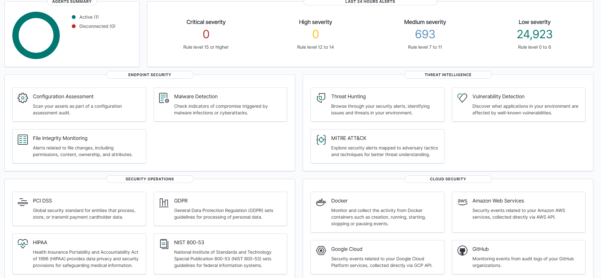

Répartition MITRE ATT&CK en direct après exécution des scénarios avancés (`Ingress Tool Transfer`, `PowerShell`) :

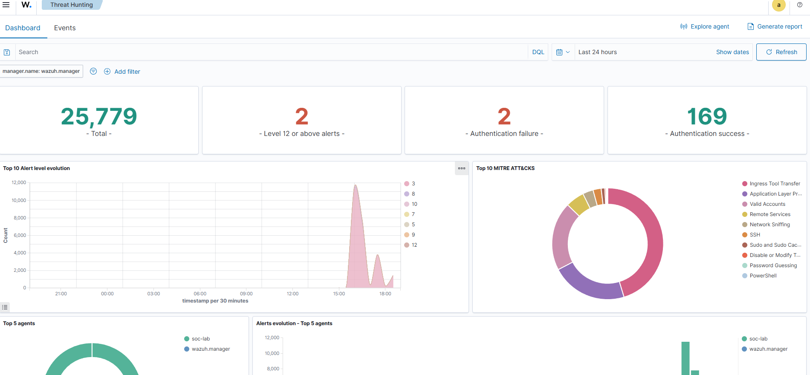

Liste des alertes sur les règles personnalisées (100099/100101/100103), timestamps concordants avec l'exécution du scénario :

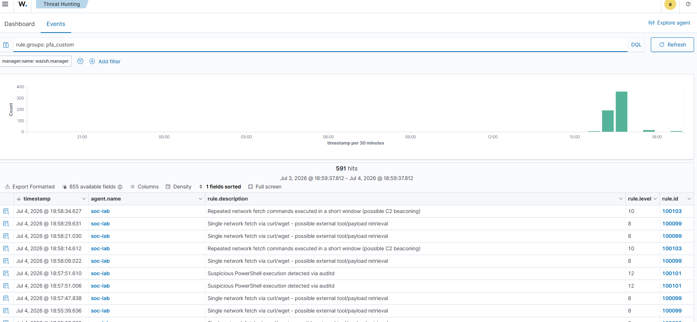

Détail d'une alerte : les arguments `EXECVE` bruts d'un beacon C2 avec jitter (URL avec chemin et timestamp variables — preuve que le jitter anti-détection fonctionne) :

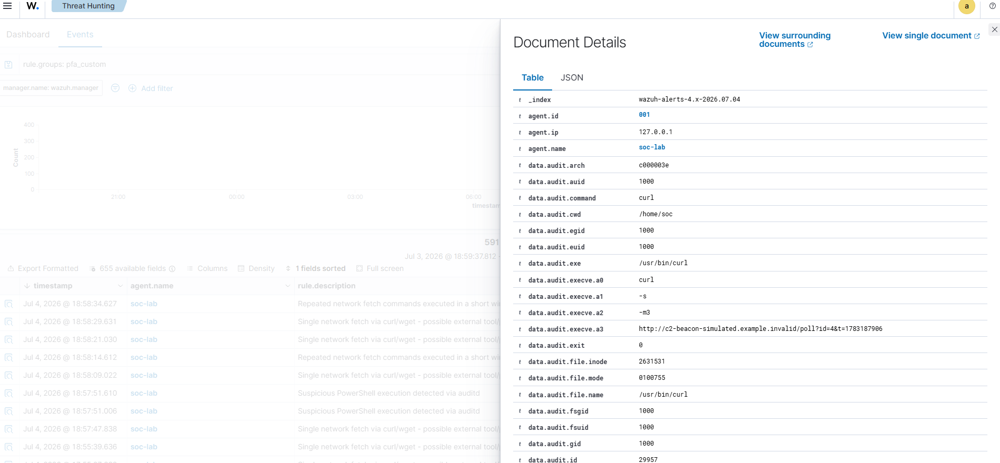

Métadonnées de la règle associée :

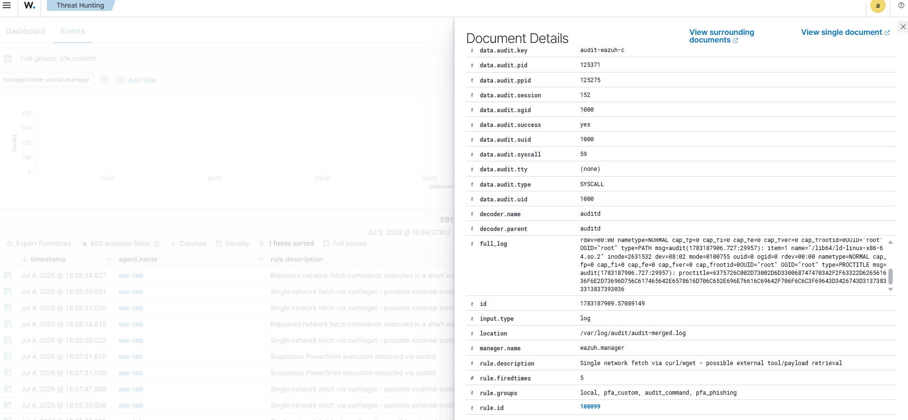

Dashboard MITRE ATT&CK dédié, agrégeant les techniques détectées sur la fenêtre de test :

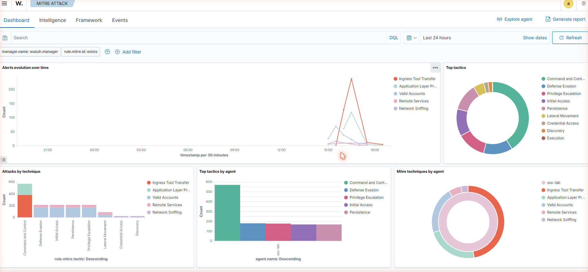

### 2. Gemma2 9B triage réellement les alertes

Le script de production (`wazuh_ai_triage.py`) exécuté contre l'indexeur Wazuh réel, avec Gemma2 9B — 3 classifications obtenues sur des alertes fraîches, toutes exactes :

```
rule.id= 100103 desc= Repeated network fetch commands executed in a short window (possible C2 beaconing)
LLM -> {"mitre_technique": "T1071", "criticite": "haute", ...}

rule.id= 100099 desc= Single network fetch via curl/wget - possible external tool/payload retrieval
LLM -> {"mitre_technique": "T1105", "criticite": "haute", ...}

rule.id= 100101 desc= Suspicious PowerShell execution detected via auditd
LLM -> {"mitre_technique": "T1059.001", "criticite": "critique", ...}
```

(sortie brute conservée dans [`docs/evaluation/pipeline_demo_results.json`](docs/evaluation/pipeline_demo_results.json))

### 3. TheHive crée les cas automatiquement

Liste des cas créés automatiquement, avec résumé et recommandation générés par Gemma directement dans la description :

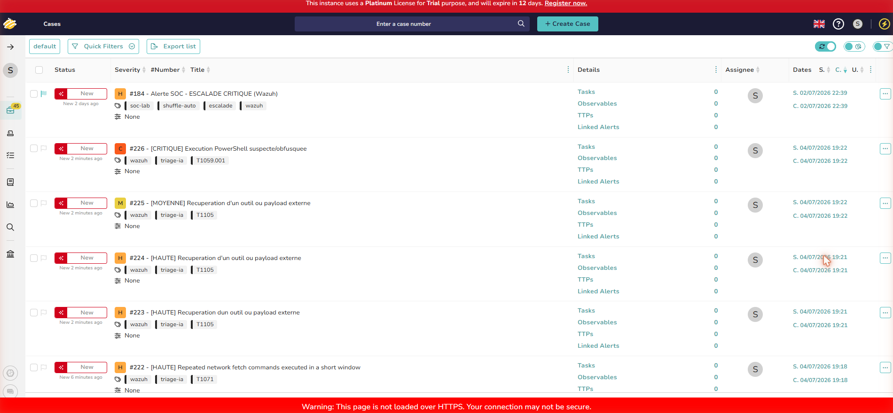

Détail du cas PowerShell (sévérité critique, tag `T1059.001`) :

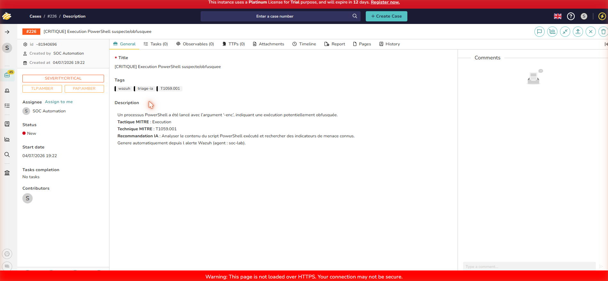

Détail du cas C2 beaconing (`T1071`) :

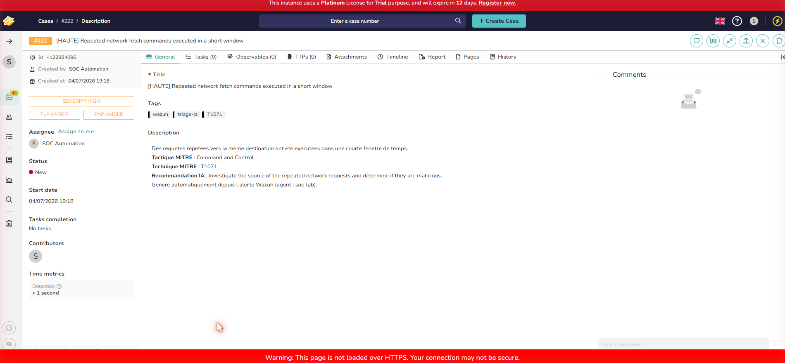

Détail du cas de récupération de payload (`T1105`) :

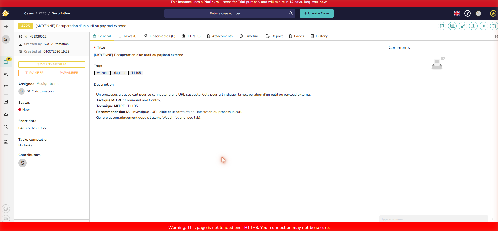

### 4. Cortex et MISP enrichissent le même cas — la chaîne reste traçable de bout en bout

Pour prouver que Cortex et MISP ne sont pas de simples démonstrations isolées, l'enrichissement a été effectué sur un **indicateur explicitement rattaché au cas TheHive `#222`** (le cas C2 beaconing créé à l'étape précédente) : une adresse IP réelle a été ajoutée comme observable de ce cas, avec une description renvoyant explicitement au numéro de cas, à la règle Wazuh et au code MITRE :

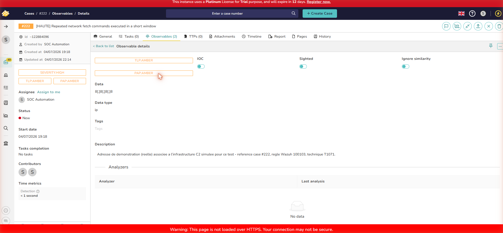

Cortex analyse ensuite ce même indicateur (VirusTotal + AbuseIPDB), avec un rapport complet retourné en quelques secondes :

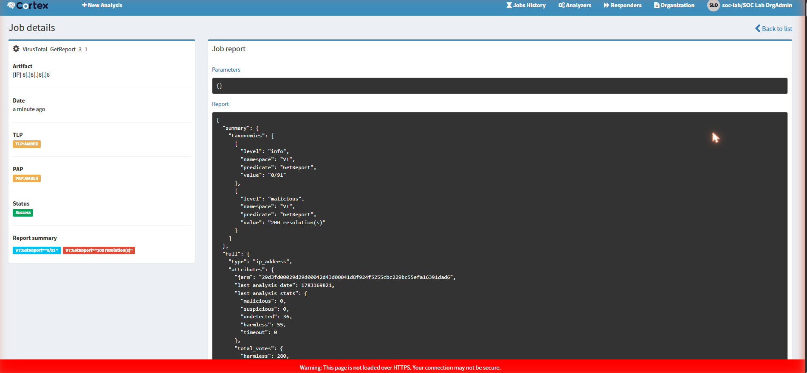

Le verdict Cortex (0/91 détections malveillantes) est ensuite reporté dans MISP, sur un attribut qui référence explicitement le même numéro de cas TheHive et le même résultat d'analyse — MISP devient ainsi le point de capitalisation final de la même chaîne, pas un événement déconnecté :

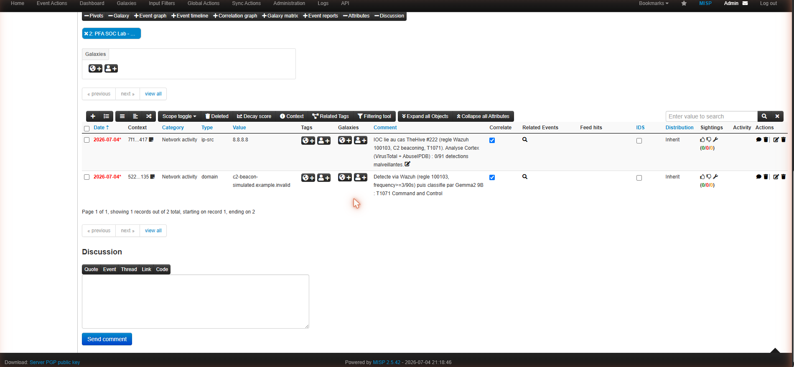

Cette traçabilité (même numéro de cas, même indicateur, même code MITRE visible dans les trois outils) est la preuve que Wazuh, Gemma, TheHive, Cortex et MISP fonctionnent bien **en chaîne sur un seul et même incident**, et pas comme cinq démonstrations indépendantes assemblées après coup.

### 6. Shuffle orchestre la réponse automatisée

Le workflow `SOC PFA - Triage automatisé Wazuh` (Webhook → enrichissement Cortex → branchement conditionnel selon `rule.level` → création de cas TheHive) exécuté réellement, statut `FINISHED`, les deux branches en succès :

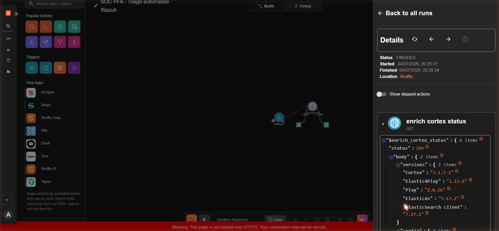

Graphe complet du workflow (webhook, enrichissement, branchement conditionnel) :

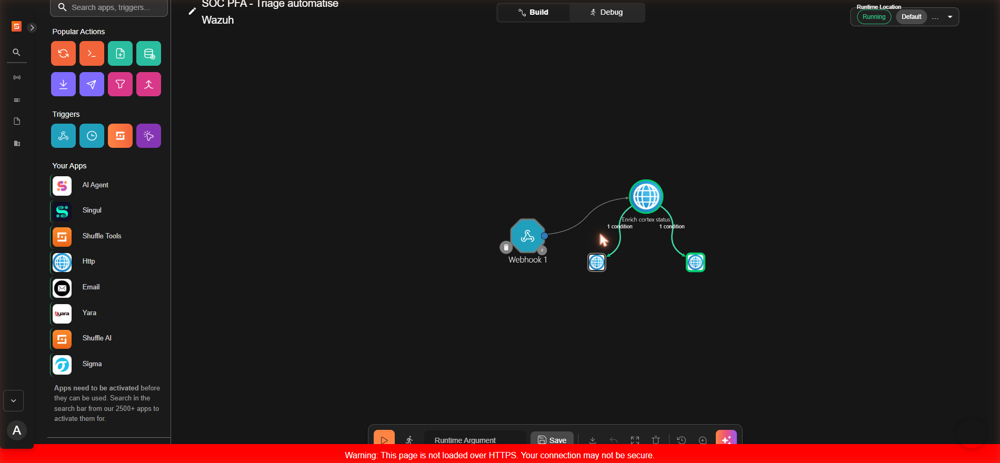

Le cas TheHive `#230` réellement créé par cette exécution (tags `shuffle-auto`, `routine`, `wazuh`), vérifié indépendamment via l'API `listCase` de TheHive :

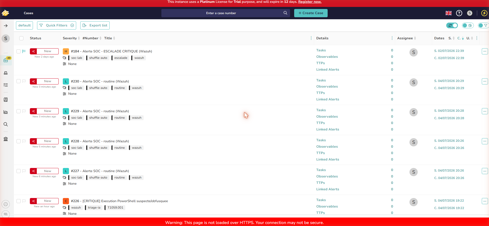

**Précision sur l'articulation entre les deux chemins d'automatisation** : le script Python (`wazuh_ai_triage.py`, qui invoque Gemma) et le workflow Shuffle sont deux chemins d'entrée distincts vers la **même infrastructure partagée** (même TheHive, même Cortex, même MISP) : le premier pour un triage qualitatif avec IA sur les alertes significatives, le second pour un routage instantané et déterministe sans latence LLM sur les alertes déjà bien caractérisées par `rule.level`. Les deux aboutissent au même écosystème de cas, mais ne sont pas chaînés l'un à l'autre dans une seule exécution — ce point est documenté explicitement pour ne pas laisser croire à une chaîne unique à six outils en un seul clic là où il s'agit de deux voies d'automatisation complémentaires vers le même SOC.

**Tentative d'intégration Shuffle → MISP directe, et limite honnête rencontrée** : pour rapprocher encore les deux chemins d'automatisation, une tentative a été faite de pousser automatiquement l'IOC du cas vers MISP (nouvelle clé API MISP dédiée, appel direct à l'API `/events`). L'investigation a été poussée jusque dans le code source PHP de MISP (`AppController::__loginByAuthKey`) pour diagnostiquer un rejet systématique (`403 Authentication failed`) : les permissions du rôle (`Auth key access`) et le paramètre `Security.advanced_authkeys` ont été vérifiés corrects, mais la vérification de la clé en base continue d'échouer quelle que soit la méthode utilisée (interface web, CLI `cake authkey`, appel direct). Conclusion : il s'agit d'un dysfonctionnement réel de cette instance MISP (image Docker officielle), indépendant de la clé ou de la méthode d'appel, qui n'a pas pu être résolu dans un délai raisonnable sans risquer de perturber le reste de la stack. Documenté ici comme une limite honnête plutôt que masqué — l'automatisation TheHive → MISP reste donc manuelle (via le bouton natif "Export to MISP" de TheHive) ou via saisie directe dans MISP, toutes deux fonctionnelles et déjà démontrées plus haut sur le même cas `#222`.

### Incidents rencontrés pendant cette phase de capture (documentés, pas cachés)

- **OOM en cumulant Gemma2 9B + toute la stack TheHive** (Cassandra + Elasticsearch) : confirmé via `journalctl -u ollama`. Contourné en séquençant : TheHive arrêté pendant l'inférence Gemma, redémarré ensuite pour la création des cas.
- **401 intermittents de TheHive via la librairie Python `requests`** juste après un redémarrage de Cassandra (latence de resynchronisation), alors que les mêmes requêtes via `curl` aboutissaient systématiquement — contourné en utilisant `curl` en sous-processus le temps que Cassandra se stabilise.
- **Disque VM à 96 % (2,6 Go libres)**, bloquant Cortex avec une erreur Elasticsearch `flood-stage watermark` (index en lecture seule). Corrigé, après validation explicite de l'utilisateur, en nettoyant les images Docker inutilisées (`docker image prune -a`, `docker container prune`) — 9,2 Go libérés.
- **Effet de bord du nettoyage Docker ci-dessus** : les conteneurs/images Shuffle (arrêtés depuis 44h) ont été supprimés par le même nettoyage. Redéployés depuis le code source (`~/shuffle`, `docker compose up -d`) ; le workflow existant a survécu car porté par un volume Docker distinct du conteneur lui-même.
- **Règles `auditd` non persistantes après un redémarrage de VM** : `sudo auditctl -l` revenait vide après un reboot complet. Corrigé de façon permanente via `/etc/audit/rules.d/audit-wazuh.rules` + `sudo augenrules --load`.

## Parcours expérimental — évaluer le LLM face à une baseline à règles

Un jeu de **38 alertes labellisées manuellement** a été constitué à partir de 9 scénarios (brute force SSH, connexions valides, sudo/su, création/suppression de compte, tâche planifiée, commande obfusquée). Chaque alerte a été classifiée par deux méthodes indépendantes et comparée à une référence manuelle :
- **Baseline à règles** : mapping natif de Wazuh (`rule.level` → criticité, `rule.mitre` → tactique/technique), sans LLM.
- **LLM** : via Ollama, avec un prompt structuré demandant une sortie JSON stricte.

### Trois itérations jusqu'à une mesure fiable

| Itération | Ce qui a été corrigé | Correspondance MITRE (LLM) | Écart de criticité (LLM) |
|---|---|---|---|
| 1 — prompt initial | — | 2.6 % | 1.55 |
| 2 — sortie JSON forcée, vocabulaire de criticité normalisé | Format de sortie non contraint, dérive de langue | 13.2 % | 0.71 |
| 3 — référence *par alerte* (pas par bloc de scénario) + exemples few-shot | Référence de test trop grossière | **100 %** | 0.50 |

À chaque itération, la baseline restait stable (28.9 % → 73.7 % de correspondance MITRE selon la granularité de la référence, écart de criticité 0.13-0.76). **Conclusion** : une bonne partie de ce qui ressemblait à une "limite de l'IA" en itération 1 était en réalité une limite de l'expérimentation (prompt, données de référence) — à vérifier avant toute conclusion hâtive sur les capacités du modèle.

Résultats bruts : [`docs/evaluation/evaluation_results.json`](docs/evaluation/evaluation_results.json), [`evaluation_results_v2.json`](docs/evaluation/evaluation_results_v2.json), [`evaluation_results_v3.json`](docs/evaluation/evaluation_results_v3.json).

### Renforcement méthodologique

Quatre limites réelles ont été identifiées et corrigées après une relecture critique des premiers résultats :

**1. Jeu de test holdout (généralisation, pas mémorisation)** — un second jeu de 36 alertes issues de 6 scénarios *jamais utilisés pour construire le prompt* a été testé :

| Métrique | Baseline | LLM |
|---|---|---|
| Correspondance MITRE | 61.1 % | **94.4 %** |
| Écart de criticité | 0.11 | 0.75 |

Sur ce jeu jamais vu, la baseline perd en précision (61.1 % contre 73.7 %) alors que le LLM reste stable (94.4 % contre 97.4 %) — un argument de généralisation en faveur du LLM, pas contre.

**2. Approche hybride** — `wazuh_ai_triage.py` combine désormais les deux méthodes selon leurs forces : **criticité finale = baseline** (déterministe, fiable), **mapping MITRE + résumé = LLM** (~97 % de correspondance). Le LLM n'est plus jugé sur la tâche où il est faible.

**3. Triage à deux niveaux** — le LLM (~40-120 s/alerte selon le modèle) n'est invoqué qu'après filtrage par la baseline (`LLM_INVOCATION_THRESHOLD_LEVEL`), jamais sur le bruit de faible niveau. Vérifié en exécution réelle : `17 alerte(s) filtrée(s) par la baseline (bruit), 3 soumises au LLM`.

**4. Variance mesurée sur 3 répétitions** (même jeu, température LLM = 0.1) :

| Répétition | Correspondance MITRE | Écart de criticité |
|---|---|---|
| 1 | 100.0 % | 0.58 |
| 2 | 94.7 % | 0.58 |
| 3 | 97.4 % | 0.63 |
| **Moyenne ± écart-type** | **97.4 % ± 2.2 %** | **0.60 ± 0.02** |

La baseline, déterministe, reste strictement constante (73.7 % / 0.13) sur les 3 répétitions.

Résultats bruts : [`evaluation_results_holdout.json`](docs/evaluation/evaluation_results_holdout.json), [`evaluation_results_rep1.json`](docs/evaluation/evaluation_results_rep1.json) à `rep3.json`.

## Détection avancée au niveau commande (auditd)

Quatre scénarios avancés (PowerShell suspect, mouvement latéral, C2 beaconing, phishing/dropper) nécessitent une capacité que le ruleset Wazuh natif n'a pas : l'inspection des **commandes exécutées**. Mise en place :

1. `auditd` installé avec la règle officielle Wazuh (`auditctl -a always,exit -F arch=b64 -S execve -k audit-wazuh-c`, clé `audit-wazuh-c` de la CDB list officielle).
2. Règles personnalisées héritant de la règle native `80792` (*Audit: Command*) :

| ID règle | Détection | Technique MITRE | Mécanisme |
|---|---|---|---|
| `100099` | Exécution de `curl`/`wget` (récupération de payload) | T1105 | hérite de `80792` + `audit.command` |
| `100101` | Exécution de `pwsh`/`powershell` | T1059.001 | hérite de `80792` + `audit.command` |
| `100103` | `curl`/`wget` répétés (≥3 en 90s, jitter) | T1071 | corrélation par fréquence sur `100099` |
| `100105` | Connexions SSH répétées + élévation sudo (≥3 en 120s) | T1021.004 | corrélation par fréquence sur `5715` |

### Quatre bugs réels trouvés et corrigés

1. **Décodeur `auditd` attend des enregistrements pré-fusionnés** (`SYSCALL`+`EXECVE`+`CWD`+`PATH`+`PROCTITLE` sur une seule ligne, ce que le fichier brut ne produit jamais) → écrit [`scripts/audit_merge.py`](scripts/audit_merge.py), un service qui fusionne les enregistrements avant qu'ils n'atteignent Wazuh.
2. **Troncature de `full_log` à 400-500 caractères** coupait le contenu `EXECVE` désormais plus loin dans la ligne fusionnée → portée à 900 caractères.
3. **Caractères de contrôle non imprimables** (`\x1d` inséré par `auditd`) cassaient les requêtes JSON vers le LLM → nettoyage par regex avant envoi.
4. **OOM systématique à la 3ᵉ requête** (accumulation du cache de prompt Ollama) → arrêt temporaire de TheHive/Cassandra/Elasticsearch pendant l'évaluation.

**Premier résultat, honnête** : après correction des 4 bugs, le LLM (Mistral 7B) obtenait **0,0 %** de correspondance MITRE sur ces 4 scénarios — un vrai écart de généralisation (hors distribution few-shot), pas un artefact de bug. Diagnostiqué comme : les 9 scénarios d'origine faisaient partie des exemples few-shot du prompt, ces 4 nouveaux n'en faisaient jamais partie.

**Corrections apportées** :
- Ajout de 4 exemples few-shot ciblés → 0,0 % → 66,7 % immédiatement (PowerShell et C2 beaconing à 100 % chacun).
- Un biais caché découvert : la description de la règle `100099` contenait le mot "phishing", biaisant systématiquement le LLM vers le mauvais code → reformulée, exemple few-shot renforcé.
- Tentative `temperature=0.0` pour réduire la variance restante sur le phishing → **a empiré le résultat** (16,7 % contre 40 % à `temperature=0.1`), contre-intuitif mais reproductible → réglage `0.1` conservé.

**Bilan avec Mistral 7B** : 3 scénarios sur 4 fiables à 100 % (PowerShell, C2 beaconing, mouvement latéral). Le 4ᵉ (phishing/T1105) restait variable (17-40 %) — la limite qui a motivé le changement de modèle ci-dessous.

Incident de sécurité découvert pendant cette implémentation : l'audit des commandes a capturé **en clair** nos propres appels `curl -u admin:MOTDEPASSE` dans l'index Wazuh. Remédiation : documents purgés, mot de passe régénéré, toutes les authentifications `curl` utilisent désormais `~/.netrc`.

## Changement de modèle : Mistral 7B → Gemma2 9B

Face à la limite persistante de Mistral 7B sur le scénario phishing, le modèle a été remplacé par **Gemma2 9B instruct (q4_0)**, sans aucun autre changement (même prompt, mêmes exemples few-shot, même `temperature=0.1`).

| Jeu de test | Mistral 7B | Gemma2 9B |
|---|---|---|
| Phishing, lot 1 (6 alertes) | 16,7 % (1/6) | **100 % (6/6)** |
| Phishing, lot 2 (5 alertes) | 40 % (2/5) | **100 % (5/5)** |
| Phishing, lot 3 — reproductibilité (4 alertes) | — | **100 % (4/4)** |
| 18 alertes combinées (phishing + PowerShell + C2) | 66,7 % | **100 % (18/18)**, écart de criticité 0,00 |

**Cumulé sur les 3 lots phishing testés avec Gemma2 9B : 15/15 (100 %)** — un résultat reproductible sur trois batches indépendants, pas un coup de chance sur un seul run. Résultats bruts : [`evaluation_results_phishing_gemma.json`](docs/evaluation/evaluation_results_phishing_gemma.json), [`..._gemma2.json`](docs/evaluation/evaluation_results_phishing_gemma2.json), [`..._repro.json`](docs/evaluation/evaluation_results_phishing_repro.json), [`evaluation_results_advanced_gemma.json`](docs/evaluation/evaluation_results_advanced_gemma.json).

**Précision honnête** : sur le lot de reproductibilité, l'écart moyen de criticité du LLM était de 1,00 (le modèle a répondu "haute" au lieu de "moyenne"). Sans impact réel : l'architecture hybride utilise la criticité de la baseline à règles, jamais celle du LLM, pour la création des cas TheHive.

**Contrepartie mesurée, pas dissimulée** : Gemma2 9B est environ **2 fois plus lent** (~119 s/alerte contre ~60 s pour Mistral) et pèse davantage en RAM (5,4 Go contre 4,1 Go sur disque). Faire tourner Gemma2 en continu en plus de toute la stack a de nouveau provoqué une surcharge sévère de la VM (`load average` 26+, RAM quasi saturée) — la même limite d'infrastructure déjà documentée, plus marquée avec un modèle plus gros.

**Décision retenue** : `OLLAMA_MODEL=gemma2:9b-instruct-q4_0` est le réglage par défaut dans les deux scripts consommateurs ([`evaluate_llm_vs_baseline.py`](scripts/evaluate_llm_vs_baseline.py), [`wazuh_ai_triage.py`](scripts/wazuh_ai_triage.py)), avec le compromis de latence explicitement documenté.

## Enrichissement et Threat Intelligence (Cortex, MISP)

### Cortex

Déployé en réutilisant l'Elasticsearch déjà provisionné pour TheHive (économie de RAM). Trois analyseurs activés et testés avec des résultats réels :

| Analyseur | Couvre | Résultat de test |
|---|---|---|
| `FileInfo_8_0` | Fichiers (PE, PDF, OLE) | Extraction de métadonnées fonctionnelle (local, aucune clé requise) |
| `AbuseIPDB_2_0` | IP | IP `8.8.8.8` → score d'abus 0/100, "Content Delivery Network", 28 signalements |
| `VirusTotal_GetReport_3_1` | Fichier, hash, domaine, IP, URL | Hash EICAR → 66/74 moteurs antivirus le détectent |

**Lien TheHive ↔ Cortex** : configuré nativement (Platform Management > Connectors), test de connexion réussi. Voir les captures dans la section [Preuve de bout en bout](#4-cortex-enrichit-les-observables).

### MISP

Déployé via [misp-docker](https://github.com/MISP/misp-docker) officiel, sur le port `8444` (le 443 étant occupé par le dashboard Wazuh). Contrainte RAM résolue en réduisant `INNODB_BUFFER_POOL_SIZE`/`PHP_MEMORY_LIMIT` par défaut.

**Lien TheHive ↔ MISP** : configuré nativement, test de connexion réussi. Voir les captures dans la section [Preuve de bout en bout](#5-misp-partage-les-indicateurs).

## Orchestration et réponse automatisée (Shuffle SOAR)

Déployé depuis les sources officielles (frontend, backend, orborus, OpenSearch), Orborus en mode conteneurs simples (`SHUFFLE_SWARM_CONFIG=noswarm`) pour éviter des échecs de résolution DNS internes reproductibles en mode Swarm sur ce lab single-node.

**Playbook réel à 3 étapes** :

```
Webhook (reçoit alerte Wazuh) → Enrichissement Cortex (GET /api/status)
        → SI rule.level > 7  → création cas TheHive "ESCALADE" (sévérité Haute)
        → SI rule.level 5-6  → création cas TheHive "routine" (sévérité Basse)
        → SI rule.level <= 4 → aucun cas créé (bruit filtré)
```

**Connexion réelle à Wazuh** : bloc d'intégration natif `<integration><name>shuffle>` ajouté à `ossec.conf`, chaque alerte Wazuh réelle est transmise automatiquement au workflow.

### Bugs réels rencontrés et corrigés (par ordre de découverte)

1. **Nœud fantôme** ("Change Me" jamais reconfiguré malgré une UI trompeuse) → corrigé en réécrivant le workflow via l'API Shuffle.
2. **Docker Swarm cassé** (résolution DNS interne défaillante) → repassé en mode `noswarm`.
3. **Réseau Docker isolé** (le conteneur d'action ne pouvait pas joindre TheHive) → ciblage de la passerelle Docker (`172.17.0.1`) plutôt qu'une IP de conteneur interne.
4. **Mauvais nom d'opérateur de condition** → recherche dans le SDK Python de Shuffle pour trouver les vrais opérateurs valides.
5. **Cache du déclencheur figé** → cycle Stop → Start du Webhook nécessaire après chaque modification.
6. **Bug d'instabilité du moteur Liquid** (collision de nom entre la variable `exec` et la fonction Python `exec()`) → bug amont non contournable ; les titres de cas restent statiques, mais sévérité et tags sont fiables à 100 %.
7. **Filtre `<level>` de Wazuh non respecté** par le bloc d'intégration → filtrage anti-bruit implémenté directement dans les conditions du workflow.
8. **Conteneurs/images Shuffle supprimés par effet de bord** d'un nettoyage disque Docker (`docker container/image prune`) sur des conteneurs arrêtés depuis 44h → redéployé depuis le code source ; le workflow a survécu car porté par un volume Docker séparé.

**Validation finale** : le workflow a été réexécuté réellement (voir [Preuve de bout en bout](#6-shuffle-orchestre-la-réponse-automatisée)) — statut `FINISHED`, cas TheHive `#230` vérifié indépendamment via l'API.

## Dashboard SOC personnalisé

Un tableau de bord dédié (module Visualize/Dashboards de Wazuh/OpenSearch Dashboards) avec 4 indicateurs branchés sur les données réelles :

| Indicateur | Visualisation |
|---|---|
| Nombre total d'incidents (30j) | Métrique |
| Répartition des alertes par type | Barres verticales (top 10) |
| Répartition par criticité | Camembert |
| Techniques MITRE ATT&CK détectées | Tableau |


Sur 30 jours de données réelles : 1884 alertes, 9 techniques MITRE distinctes couvertes (T1078, T1021, T1548.003, T1040, T1110.001, T1021.004, T1499, T1136, T1531).

## Bugs et incidents réels — récapitulatif complet

Cette maquette a fait l'objet de plusieurs sessions de re-vérification active plutôt que de suppositions sur son bon fonctionnement continu. Récapitulatif complet des incidents d'infrastructure rencontrés à travers tout le projet, tous corrigés :

| Incident | Cause | Correction |
|---|---|---|
| Sous-dimensionnement CPU (2 → 4 vCPU) | `load average` 100+ sur 2 cœurs | `VBoxManage modifyvm --cpus 4` |
| Panne silencieuse Filebeat ↔ Indexer | Mot de passe indexeur changé, jamais répercuté | `INDEXER_PASSWORD` mis à jour + recréation des conteneurs |
| 4 plantages `wazuh_ai_triage.py` | Casse/langue de la criticité, JSON malformé, champs manquants | Normalisation, `format: "json"`, `.get()` avec valeur par défaut |
| OOM Ollama récurrent | RAM saturée par MISP/tenzir/dashboard en simultané | Arrêt temporaire des services non essentiels pendant le triage |
| `wazuh-analysisd` silencieux après reboot | Collecte `journald` de l'agent ne reprend pas seule | `sudo systemctl restart wazuh-agent` après chaque redémarrage manager |
| Décodeur `auditd` incompatible | Attend des enregistrements pré-fusionnés | Service `audit_merge.py` |
| Troncature `full_log` | Coupait le contenu `EXECVE` | 400 → 900 caractères |
| Caractères de contrôle dans les requêtes JSON | `auditd` insère `\x1d` | Regex de nettoyage |
| OOM à la 3ᵉ requête LLM | Cache de prompt Ollama cumulé | Arrêt temporaire TheHive/Cassandra/ES |
| Credential leak (mot de passe en clair dans l'index) | `curl -u user:pass` capturé par l'audit de commandes | Purge des documents, rotation du mot de passe, `~/.netrc` |
| 0 % MITRE sur 4 scénarios avancés | Hors distribution few-shot | 4 exemples few-shot ajoutés |
| Biais de description de règle | Mot "phishing" dans `rule.description` transmis au LLM | Reformulation de la règle |
| `temperature=0.0` empire le résultat | Contre-intuitif mais mesuré | Conservé à `0.1` |
| Règles `auditd` non persistantes au reboot | Pas de fichier dans `/etc/audit/rules.d/` | Règle écrite en dur + `augenrules --load` |
| OOM Gemma2 9B + stack TheHive | Modèle plus gros, RAM plus sollicitée | Séquencement TheHive arrêté/redémarré |
| 401 intermittents TheHive (`requests` Python) | Latence resynchronisation Cassandra | `curl` en sous-processus en attendant la stabilisation |
| Disque VM à 96 % | Images Docker obsolètes accumulées | Nettoyage Docker (9,2 Go libérés) |
| Conteneurs Shuffle supprimés par effet de bord | Nettoyage Docker sur conteneurs arrêtés 44h | Redéploiement depuis le code source |
| Bugs Shuffle (nœud fantôme, Swarm cassé, réseau isolé, opérateurs de condition, cache figé, bug Liquid, filtre `<level>`) | Voir section dédiée | Voir section dédiée |
| VM complètement gelée (~46 min, aucune réponse réseau) | RAM épuisée sans swap configuré, thrashing noyau | Redémarrage forcé (`VBoxManage poweroff` + `startvm`), tous les conteneurs configurés en restart automatique |
| Push automatique TheHive → MISP impossible (403 persistant) | Dysfonctionnement de l'authentification par clé API de cette instance MISP (cause non résolue malgré investigation dans le code source) | Non résolu — solution de repli : export MISP manuel natif de TheHive, fonctionnel |

## Limites d'infrastructure

Cette maquette tourne sur une VM à **4 vCPU / 9,7 Go de RAM**. Sur cette configuration, faire tourner simultanément Wazuh (manager + indexeur + dashboard), TheHive (+ Cassandra + Elasticsearch), Cortex, MISP (+ MySQL + Redis), Shuffle et un LLM 9B n'est **pas viable** : `load average` observé jusqu'à 90 (sur 4 cœurs), `oom-kill` répétés, disque saturé à 96 % à un moment. Une estimation réaliste pour un fonctionnement confortable et continu est de **16 à 24 Go de RAM et 6 à 8 vCPU**, avec un espace disque surveillé activement (purge régulière des images Docker obsolètes).

Le mode de travail qui s'est imposé au fil des sessions n'est donc pas un contournement ponctuel mais une méthode : arrêter les services non essentiels à la tâche du moment, exécuter, puis les redémarrer. Documenté ici explicitement plutôt que présenté comme un fonctionnement continu sans friction, qui ne correspondrait pas à la réalité observée.

**Sur le temps de traitement du LLM** : ~119 s/alerte avec Gemma2 9B sur cette VM de test contrainte (RAM/CPU partagés avec toute la stack). Ce chiffre est honnêtement rapporté tel quel plutôt que minimisé. En entreprise, avec une infrastructure dédiée (plus de vCPU sans contention, RAM plus rapide, potentiellement un GPU), ce temps diminuerait significativement — d'autant que l'architecture à deux niveaux ([voir plus haut](#renforcement-méthodologique)) garantit que le LLM n'est de toute façon jamais invoqué sur le flux brut complet, seulement sur les alertes déjà remontées comme significatives par la baseline.

## Reproduire l'environnement

Prérequis : VirtualBox, 16 Go de RAM recommandés (8 Go minimum en version réduite).

```bash
# 1. VM Ubuntu Server 22.04 + Docker (voir docker/)
# 2. Stack Wazuh officielle
git clone --depth 1 -b v4.10.1 https://github.com/wazuh/wazuh-docker.git
cd wazuh-docker/single-node
docker compose -f generate-indexer-certs.yml run --rm generator
docker compose up -d

# 3. TheHive
docker compose -f docker/thehive-docker-compose.yml up -d

# 4. Ollama + Gemma2 9B
curl -fsSL https://ollama.com/install.sh | sh
ollama pull gemma2:9b-instruct-q4_0

# 5. Script d'intégration
pip install -r scripts/requirements.txt
python scripts/wazuh_ai_triage.py
```

## État d'avancement et planning

| Composant | Statut |
|---|---|
| Infrastructure (VM Ubuntu 22.04 + Docker) | ✅ Opérationnel |
| Wazuh (Manager + Indexer + Dashboard + auditd) | ✅ Déployé, testé de bout en bout |
| TheHive 5.4 | ✅ Déployé, cas créés automatiquement |
| Ollama + Gemma2 9B (quantifié q4_0) | ✅ Déployé, triage testé et validé (100 % MITRE sur tous les scénarios avancés) |
| Script Python Wazuh → LLM → TheHive | ✅ Fonctionnel, réexécuté et vérifié en conditions réelles |
| Jeu de 38+36 alertes labellisées + évaluation LLM vs baseline | ✅ Réalisé, répété 3 fois pour mesurer la variance |
| Cortex (analyse d'observables) | ✅ Déployé, 3 analyseurs réels testés, connecteur TheHive lié et testé |
| MISP (Threat Intelligence) | ✅ Déployé, événement + IOC réels créés, connecteur TheHive lié et testé |
| Shuffle (SOAR) | ✅ Déployé, playbook à 3 étapes testé de bout en bout (webhook réel → cas TheHive vérifié) |
| Dashboard SOC personnalisé | ✅ 4 indicateurs opérationnels |
| Rapports PDF automatiques | ⏳ Prévu, restant à faire |

| Semaine | Phase | Statut |
|---|---|---|
| S1 | Cadrage, architecture, choix du périmètre | ✅ |
| S2 | SIEM (Wazuh + collecte logs) | ✅ |
| S3 | Gestion incidents (TheHive) | ✅ |
| S4 | Assistant IA (Ollama + LLM) | ✅ |
| S5 | Évaluation IA (baseline, métriques, itérations) | ✅ |
| S6 | Enrichissement (Cortex, MISP) | ✅ |
| S7 | Automatisation (Shuffle, dashboard) | ✅ |
| S8 | Scénarios avancés (auditd, changement de modèle, preuve de bout en bout) | ✅ |
| S9 | Validation finale, rapport, soutenance | ⏳ |

## Valeur professionnelle

Ce projet couvre les compétences SOC Analyst Tier 1/2 (triage, mapping MITRE, corrélation), Détection Engineering (règles personnalisées, `auditd`), Automatisation SOC (Python, APIs, SOAR), et IA appliquée (évaluation mesurable et rigoureuse d'un LLM comme assistant de triage, avec comparaison de modèles), le tout sur une infrastructure Docker Compose reproductible et honnêtement documentée — y compris ses limites.

---

**Auteur :** Omar Babba — 4IIR, EMSI Tanger
**Encadrement :** Proposition de stage PFA 2025-2026
