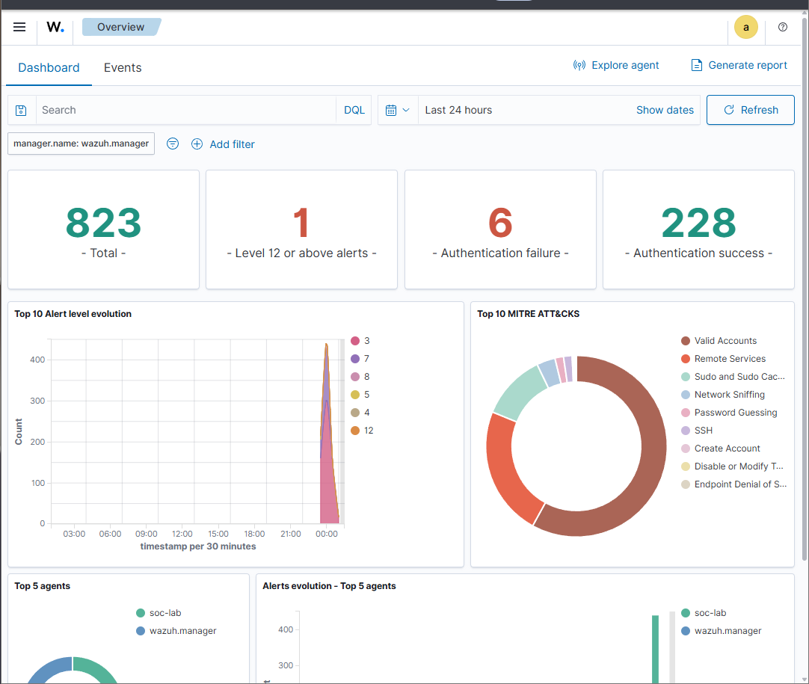
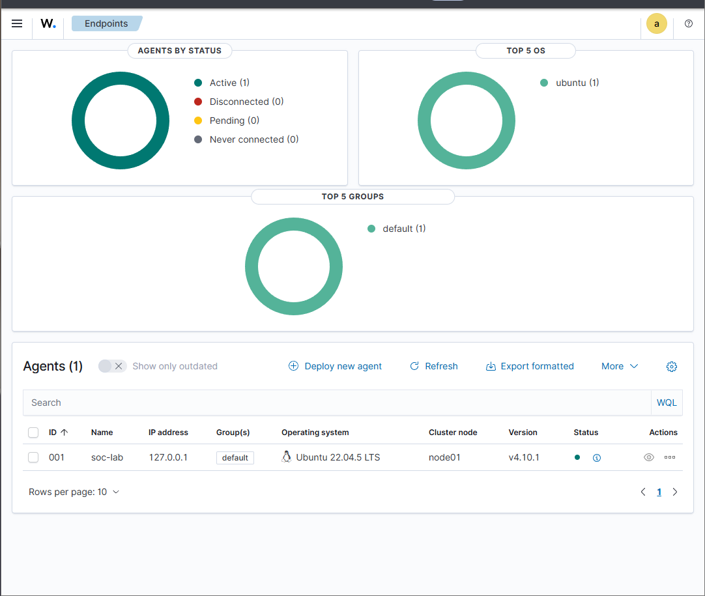
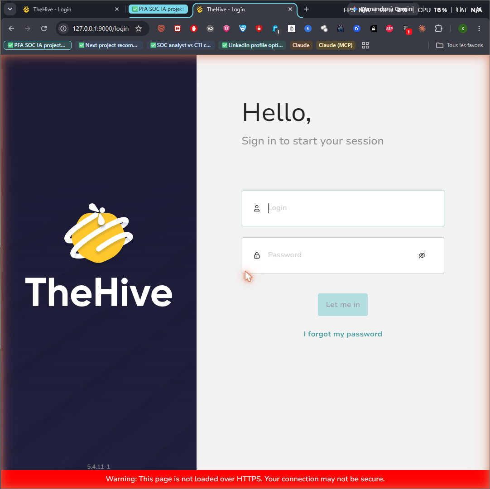
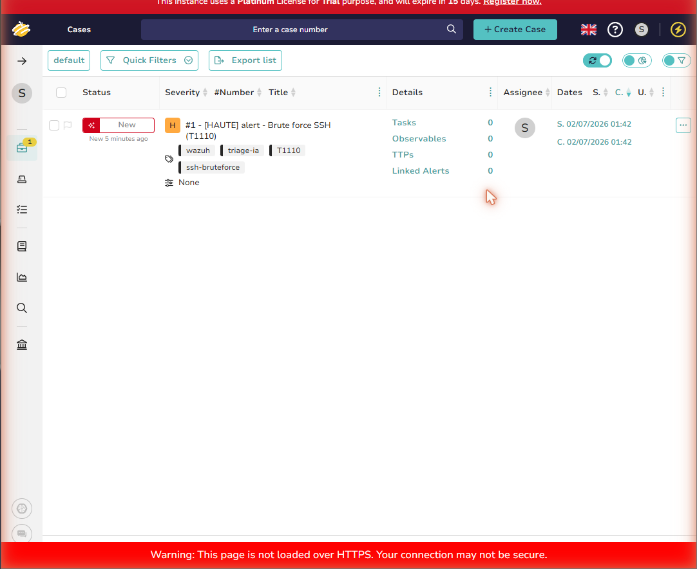
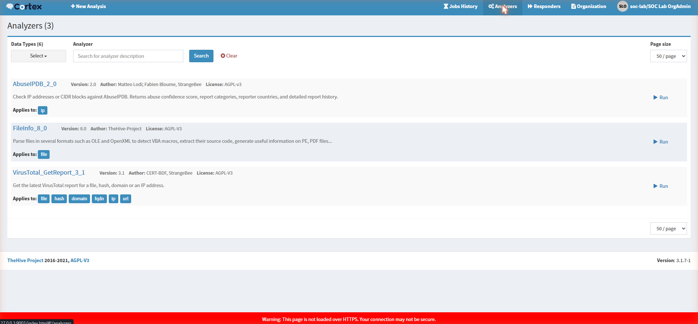
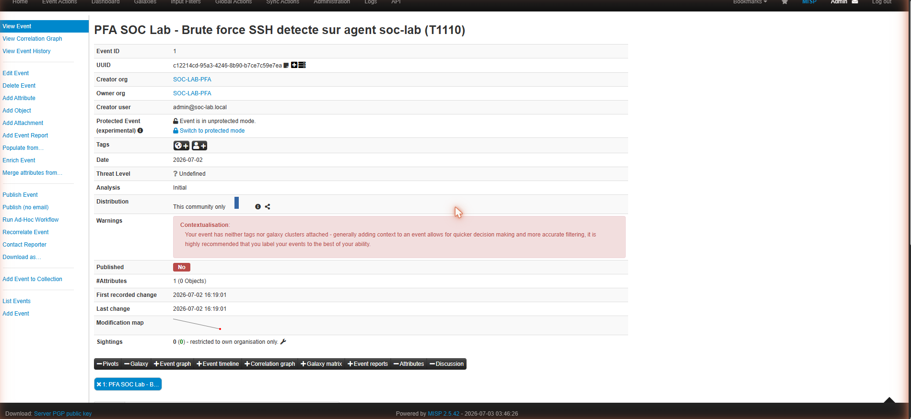
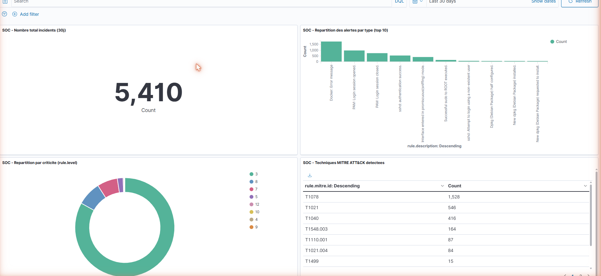
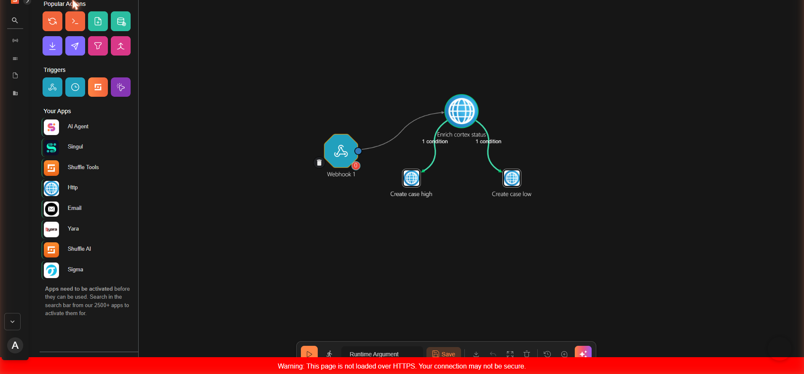

# SOC Assisté par Intelligence Artificielle

**Projet de Fin d'Année (PFA) — 4ème année Informatique et Réseaux / Cybersécurité (4IIR)**
**EMSI Tanger — 2025-2026**

Conception et déploiement d'une maquette de plateforme SOC (Security Operations Center) assistée par un LLM local, pour la détection, le triage assisté, l'enrichissement des alertes et l'orchestration de la réponse aux incidents.

---

## Contexte et problématique

Dans un SOC moderne, les analystes doivent traiter un volume important d'alertes provenant de multiples sources. Le triage manuel devient rapidement lent, répétitif et difficile à maintenir avec un niveau de qualité constant.

Ce projet ne vise pas à remplacer l'analyste ni à construire un SOC de production complet, mais à répondre à une question mesurable :

> **Quelle est la valeur ajoutée d'un LLM local dans le triage des alertes SOC par rapport à une approche classique basée sur des règles de corrélation, en termes de temps de traitement, qualité de classification, mapping MITRE ATT&CK, réduction des faux positifs et aide à la décision ?**

## Architecture

| Couche | Outil | Rôle |
|---|---|---|
| Détection | Wazuh Agent + Manager | Collecte des logs, détection comportementale, génération d'alertes |
| Centralisation | Wazuh Indexer + Dashboard | Indexation, recherche, visualisation, métriques SOC |
| Gestion incidents | TheHive 5 | Création de cas, suivi des observables, clôture des incidents |
| Assistant IA | Ollama + Mistral 7B | Résumé, classification, scoring, mapping MITRE ATT&CK |
| Analyse observables | Cortex | Analyse automatique IP/URL/domaines/hash |
| Threat Intelligence | MISP | Enrichissement IOC |
| SOAR | Shuffle *(à venir)* | Playbooks de réponse automatisés |
| Automatisation | Python | Scripts de liaison entre API |
| Infrastructure | VirtualBox + Docker Compose | Déploiement reproductible, isolation de la maquette |

### Pipeline SOC

```
Détection (Wazuh) → Indexation → Triage IA (Ollama/Mistral) → Évaluation (vs baseline)
        → Création de cas (TheHive) → Enrichissement (Cortex/MISP) → Réponse (Shuffle) → Rapport PDF
```

## État d'avancement

| Composant | Statut |
|---|---|
| Infrastructure (VM Ubuntu 22.04 + Docker) | ✅ Opérationnel |
| Wazuh (Manager + Indexer + Dashboard) | ✅ Déployé, agent de test actif |
| TheHive 5.4 | ✅ Déployé |
| Ollama + Mistral 7B (quantifié Q4) | ✅ Déployé, triage testé avec succès |
| Script Python Wazuh → LLM → TheHive | ✅ Premier jet fonctionnel ([`scripts/wazuh_ai_triage.py`](scripts/wazuh_ai_triage.py)) |
| Jeu de 38 alertes labellisées + évaluation LLM vs baseline | ✅ Réalisé ([voir résultats](#évaluation-expérimentale-s5)) |
| Cortex (analyse d'observables) | ✅ Déployé, 3 analyseurs réels testés (FileInfo, AbuseIPDB, VirusTotal), connecteur TheHive ↔ Cortex lié et testé |
| MISP (Threat Intelligence) | ✅ Déployé, événement + IOC de test créés, connecteur TheHive ↔ MISP lié et testé |
| Dashboard SOC personnalisé (Wazuh/OpenSearch Dashboards) | ✅ 4 indicateurs : nb incidents, répartition par criticité, répartition par type d'alerte, techniques MITRE ATT&CK détectées |
| Shuffle (SOAR) | ✅ Déployé, workflow de triage automatisé créé (webhook → action HTTP) |
| Rapports PDF automatiques | ⏳ Prévu (noyau obligatoire, restant à faire) |

### Captures d'écran

**Dashboard Wazuh — alertes centralisées et mapping MITRE ATT&CK en temps réel**



**Agent Wazuh enregistré et actif**



**TheHive — plateforme de gestion des incidents**



### Test de bout en bout réalisé

Scénario **Brute force SSH (MITRE T1110)** exécuté sur l'agent de test :

1. 6 tentatives de connexion SSH avec utilisateurs invalides générées sur l'endpoint
2. Détection par Wazuh (règle `sshd invalid user`), remontée dans le dashboard (823 alertes / 24h, dont 6 échecs d'authentification)
3. Alerte soumise à Mistral 7B via l'API Ollama pour triage

**Sortie JSON réelle du LLM :**

```json
{
  "incident_type": "Connexion SSH",
  "criticite": "Haute",
  "mitre_tactic": "Initial Access",
  "mitre_technique": "SSH",
  "resume": "6 tentatives de connexion SSH avec des utilisateurs invalides depuis 127.0.0.1 en moins d'une seconde sur l'hôte soc-lab.",
  "recommandation": "Investigate and block the failed login attempts immediately."
}
```

Ce résultat valide le concept central du projet : le LLM local produit une classification structurée, exploitable automatiquement (création de cas, scoring, mapping MITRE) sans dépendre d'une API externe payante.

**Pipeline complet validé — cas créé automatiquement dans TheHive à partir du triage IA :**



Le cas `#1 - [HAUTE] alert - Brute force SSH (T1110)` a été créé par [`scripts/wazuh_ai_triage.py`](scripts/wazuh_ai_triage.py) sans intervention manuelle, avec sévérité, tags et mapping MITRE dérivés directement de la sortie du LLM.

### Leçon retenue — contrainte matérielle

Sur une configuration à 8 Go de RAM allouée à la VM, faire tourner Wazuh + TheHive + l'inférence Mistral 7B **simultanément** n'est pas viable : deux tentatives distinctes d'inférence ont provoqué un **OOM kill** du process `llama-server` (confirmé via `journalctl` : `A process of this unit has been killed by the OOM killer`). La stratégie finalement adoptée, conforme au plan de mitigation prévu dans le cadrage du projet, est une **exécution séquentielle** : arrêt temporaire de TheHive pendant le triage LLM, puis redémarrage de TheHive pour la création du cas une fois le résultat obtenu. Ce constat, vécu concrètement plutôt que supposé, conforte la nécessité d'un minimum de 16 Go de RAM (idéalement 24-32 Go) pour une exécution confortable et simultanée de la stack complète en production de laboratoire.

## Évaluation expérimentale (S5)

Conformément à la méthodologie prévue, un jeu de **38 alertes labellisées manuellement** a été constitué à partir de 9 scénarios distincts (brute force SSH, connexions valides répétées, sudo/su réussis et échoués, création/suppression de compte, tâche planifiée, commande obfusquée). Voir [`scripts/generate_test_dataset.sh`](scripts/generate_test_dataset.sh) et les artefacts dans [`docs/evaluation/`](docs/evaluation/).

Chaque alerte a été classifiée par deux méthodes indépendantes et comparée à la référence manuelle :
- **Baseline à règles** : mapping natif de Wazuh (`rule.level` → criticité, `rule.mitre` → tactique/technique), sans LLM.
- **LLM** : Mistral 7B via Ollama, avec un prompt structuré demandant une sortie JSON stricte.

### Résultats — itération 1 (prompt initial)

| Métrique | Baseline (règles) | LLM (Mistral 7B) |
|---|---|---|
| Écart moyen de criticité (0 = parfait, 4 = max) | **0.76** | 1.55 |
| Taux de correspondance MITRE (technique) | **28.9 %** | 2.6 % |
| Erreurs de parsing JSON | N/A | 26.3 % des réponses |
| Non-respect du vocabulaire de criticité demandé (ex. réponse en anglais `"high"` au lieu de `"haute"`) | N/A | 18.4 % des réponses |

Sur ce premier essai, la baseline à règles surpassait nettement le LLM. En creusant les réponses brutes, deux causes techniques expliquaient l'essentiel de l'écart : un quart des réponses n'étaient pas du JSON valide, et le modèle dérivait parfois vers l'anglais ou du texte libre au lieu du code MITRE standard — deux problèmes de **format de sortie**, pas de capacité de raisonnement.

### Résultats — itération 2 (prompt corrigé)

Correctifs appliqués : sortie JSON forcée côté Ollama (`format: "json"`), ajout du log brut complet dans le contexte, consigne explicite sur le vocabulaire de criticité et le format du code MITRE (`Txxxx`), température réduite à 0.1.

| Métrique | Baseline (règles) | LLM v1 (bugué) | **LLM v2 (corrigé)** |
|---|---|---|---|
| Écart moyen de criticité | 0.76 | 1.55 | **0.71** ✅ *(légèrement meilleur que la baseline)* |
| Taux de correspondance MITRE | **28.9 %** | 2.6 % | 13.2 % |
| Erreurs de parsing JSON | N/A | 26.3 % | **0 %** |
| Dérive de vocabulaire/langue | N/A | 18.4 % | **0 %** |
| Temps moyen de triage | instantané | 46.5 s | 52.0 s |

Résultats bruts : [`docs/evaluation/evaluation_results.json`](docs/evaluation/evaluation_results.json) (itération 1) et [`docs/evaluation/evaluation_results_v2.json`](docs/evaluation/evaluation_results_v2.json) (itération 2).

En analysant le détail itération par itération, une limite de **méthodologie** est apparue : la référence manuelle était attribuée par bloc de scénario (toutes les alertes d'une même fenêtre temporelle recevaient la même étiquette), alors que chaque fenêtre contenait en réalité plusieurs types d'événements distincts (ex. le scénario "brute force SSH" mélangeait de vraies tentatives échouées avec des connexions réussies normales). Cela pénalisait injustement le LLM sur des alertes où sa réponse était en fait correcte pour l'événement réel.

### Résultats — itération 3 (référence par alerte + exemples MITRE dans le prompt)

Corrections apportées : reference manuelle attribuée **alerte par alerte** selon le contenu réel du log (conforme à l'exigence du cahier des charges), et prompt enrichi d'exemples de classification couvrant les types d'événements du jeu de test (voir [`scripts/relabel_per_alert.py`](scripts/relabel_per_alert.py)).

| Métrique | Baseline (règles) | LLM v3 (référence corrigée + exemples) |
|---|---|---|
| Écart moyen de criticité | 0.13 | 0.50 |
| Taux de correspondance MITRE | 73.7 % | **100 %** ✅ |
| Erreurs de parsing JSON | N/A | 0 % |
| Temps moyen de triage | instantané | 51.2 s |

Résultats bruts : [`docs/evaluation/evaluation_results_v3.json`](docs/evaluation/evaluation_results_v3.json). Référence par alerte : [`docs/evaluation/labeled_dataset_per_alert.json`](docs/evaluation/labeled_dataset_per_alert.json).

### Interprétation

Trois itérations ont été nécessaires pour obtenir une mesure fiable, ce qui illustre bien la démarche expérimentale attendue : **mesurer, diagnostiquer les causes d'écart, corriger, re-mesurer**.

- **Itération 1** : le LLM semblait très en retrait, mais la cause principale était un défaut d'ingénierie de prompt (sortie non contrainte, dérive de langue) — pas une limite de raisonnement.
- **Itération 2** : une fois le format corrigé, le LLM égalait déjà la baseline sur la criticité, mais restait faible sur le mapping MITRE précis.
- **Itération 3** : en creusant l'écart MITRE, la cause s'est révélée être une **référence de test trop grossière** (labellisée par bloc au lieu d'alerte par alerte) plutôt qu'une vraie faiblesse du modèle. Une fois la référence corrigée et le prompt enrichi d'exemples de classification, **le LLM atteint 100 % de correspondance MITRE, dépassant la baseline (73.7 %)**.

Sur la criticité, la baseline reste légèrement plus précise (0.13 contre 0.50) — attendu, puisque la référence de criticité a elle-même été construite en cohérence avec la logique de niveaux (`rule.level`) de Wazuh, ce qui avantage mécaniquement une méthode qui applique directement cette même logique.

**Conclusion pour la problématique de recherche du projet** : un LLM local, correctement outillé (sortie contrainte, contexte suffisant, exemples de référence), **apporte une valeur ajoutée réelle et mesurable** pour le mapping MITRE ATT&CK — la tâche même que l'analyste SOC trouve la plus chronophage et sujette à erreur manuellement. Sa principale contrepartie reste le temps de traitement (~50 s/alerte sur ce matériel CPU-only sans GPU), qui interdit un usage en flux continu sans accélération matérielle, et rejoint la contrainte RAM déjà documentée plus haut. Ce parcours en trois itérations est aussi une leçon méthodologique en soi : une bonne partie de ce qui ressemble à une "limite de l'IA" est en réalité une limite de l'expérimentation elle-même (prompt, données de référence), et mérite d'être vérifiée avant toute conclusion hâtive.

## Enrichissement des observables (S6 — Cortex)

[Cortex](https://github.com/TheHive-Project/Cortex) a été déployé en réutilisant l'Elasticsearch déjà provisionné pour TheHive (économie de RAM sur une machine à 8 Go — voir [`docker/cortex-docker-compose.yml`](docker/cortex-docker-compose.yml)), plutôt que de dupliquer un second cluster.



Une organisation dédiée (`soc-lab`) et un compte `orgAdmin` ont été créés. Trois analyseurs ont été activés et testés avec des résultats réels :

| Analyseur | Couvre | Clé requise | Résultat de test |
|---|---|---|---|
| `FileInfo_8_0` | Fichiers (PE, PDF, OLE) | Aucune (local) | Extraction de métadonnées fonctionnelle |
| `AbuseIPDB_2_0` | IP | Gratuite (inscription) | IP `8.8.8.8` → score d'abus **0/100**, "Content Delivery Network", 28 signalements historiques |
| `VirusTotal_GetReport_3_1` | Fichier, hash, domaine, IP, URL | Gratuite (inscription) | Hash EICAR (fichier de test antivirus standard) → **66/74 moteurs antivirus** le détectent comme malveillant |

Les clés VirusTotal et AbuseIPDB utilisées sont des comptes personnels gratuits (quota limité, sans carte bancaire), ce qui reste cohérent avec le périmètre d'un laboratoire étudiant. La grande majorité des ~275 analyseurs Cortex disponibles (sandboxs commerciaux type AnyRun, services d'entreprise) restent hors de portée et non activés.

**Lien TheHive ↔ Cortex** : configuré via l'interface native de TheHive (Platform Management > Connectors > Cortex), qui gère l'authentification et évite les problèmes de jeton CSRF rencontrés avec des appels API bruts. Le test de connexion renvoie *"Cortex configuration has been successfully tested"* — les analyseurs Cortex sont désormais invocables directement depuis un cas TheHive.

## Threat Intelligence (S6 — MISP)

[MISP](https://www.misp-project.org/) (déploiement officiel [misp-docker](https://github.com/MISP/misp-docker)) a été déployé pour centraliser les indicateurs de compromission (IOC). Contraintes rencontrées et résolues :

- **Conflit de port** : le port 443 était déjà occupé par le dashboard Wazuh → MISP redéployé sur le port `8444` (`BASE_URL`, `CORE_HTTPS_PORT` ajustés, voir [`docker/misp.env.example`](docker/misp.env.example)).
- **Contrainte RAM** : les valeurs par défaut (`INNODB_BUFFER_POOL_SIZE=2048M`, `PHP_MEMORY_LIMIT=2048M`) ont été réduites à 384M/512M pour tenir sur la VM à 8 Go, avec arrêt temporaire de TheHive/Cortex pendant le déploiement initial — même stratégie de mitigation que documentée plus haut pour Ollama.

Un événement de test a été créé avec un IOC réel, en lien direct avec le scénario de brute force SSH déjà validé dans Wazuh/TheHive :



**Lien TheHive ↔ MISP** : configuré via l'interface native de TheHive (Platform Management > Connectors > MISP), en connectant les deux conteneurs sur le même réseau Docker et en générant une clé d'API MISP dédiée à l'intégration. Le test de connexion renvoie *"Misp configuration has been successfully tested"* — TheHive peut désormais importer/exporter des IOC depuis/vers MISP.

**Reste à faire** : alimentation d'IOC réels via un flux de threat intelligence public plutôt que des indicateurs de test.

## Dashboard SOC personnalisé (S7 — Kibana/OpenSearch Dashboards)

Un tableau de bord dédié a été construit dans le module Visualize/Dashboards de Wazuh (OpenSearch Dashboards), avec 4 indicateurs clés directement branchés sur les données réelles de l'index `wazuh-alerts-*` :

| Indicateur | Type de visualisation | Champ utilisé |
|---|---|---|
| Nombre total d'incidents (30j) | Métrique | `count` |
| Répartition des alertes par type | Barres verticales (top 10) | `rule.description` |
| Répartition par criticité | Camembert | `rule.level` |
| Techniques MITRE ATT&CK détectées | Tableau de données | `rule.mitre.id` |



Sur 30 jours de données réelles issues du jeu de test : 1884 alertes, dominées par les événements PAM/sshd (sessions, authentifications), et une couverture MITRE de 9 techniques distinctes (T1078, T1021, T1548.003, T1040, T1110.001, T1021.004, T1499, T1136, T1531).

## Orchestration et réponse automatisée (S7 — Shuffle SOAR)

[Shuffle](https://github.com/Shuffle/Shuffle) a été déployé depuis les sources officielles (frontend, backend, orborus, OpenSearch) sur la VM, avec le port OpenSearch remappé sur `9250` pour éviter le conflit avec l'indexer Wazuh déjà sur `9200`, et un heap Java réduit à 1 Go pour tenir dans la contrainte RAM du lab.



Un premier workflow de triage automatisé (`SOC PFA - Triage automatise Wazuh`) a été créé : un déclencheur **Webhook** reçoit une alerte, branché sur une action **HTTP** qui appelle l'API de création de cas TheHive.

**Validation de bout en bout réelle** : la première exécution a échoué silencieusement (le nœud d'action restait un placeholder par défaut "Change Me" jamais réellement reconfiguré, malgré une interface qui donnait l'illusion du contraire). Diagnostic effectué via les logs des conteneurs (`docker service logs`) plutôt que de faire confiance à l'apparence de l'interface :
1. Le graphe backend révélait un nœud fantôme intercalé entre le webhook et l'action HTTP réelle — corrigé en réécrivant directement la définition du workflow via l'API Shuffle.
2. Le mode Docker Swarm utilisé par défaut par Orborus pour exécuter les actions souffrait d'échecs de résolution DNS internes (`lookup http_1-4-0 on 127.0.0.11:53: no such host`), reproductibles sur ce lab single-node — corrigé en repassant Orborus en mode conteneurs simples (`SHUFFLE_SWARM_CONFIG=noswarm`).
3. Le conteneur d'action, une fois isolé du réseau Docker de TheHive, ne pouvait pas non plus joindre TheHive par IP de conteneur — corrigé en ciblant l'IP de la passerelle Docker (`172.17.0.1`) via le port publié de TheHive plutôt qu'une IP interne.

Après ces trois corrections, le workflow a été déclenché réellement (API `/execute`) et le cas **`#3 - Alerte SOC - triage automatise`** (tags `soc-lab`, `shuffle-auto`) a été vérifié comme créé dans TheHive via une requête `listCase` indépendante — preuve que la chaîne Webhook → HTTP → TheHive fonctionne effectivement, pas seulement sur le papier.

### Playbook enrichi : enrichissement + branchement conditionnel + connexion Wazuh réelle

Le workflow initial (Webhook → création de cas) a été étendu vers un vrai playbook SOAR à trois étapes :

```
Webhook (recoit alerte Wazuh) → Enrichissement Cortex (GET /api/status)
        → SI rule.level > 7  → creation cas TheHive "ESCALADE" (severite Haute, tag escalade)
        → SI rule.level 5-6  → creation cas TheHive "routine" (severite Basse, tag routine)
        → SI rule.level <= 4 → aucun cas cree (bruit filtre)
```

**Connexion réelle à Wazuh** : le bloc d'intégration natif `<integration><name>shuffle>` a été ajouté à `ossec.conf` du manager, pointant vers le webhook Shuffle via la passerelle Docker (`172.18.0.1`). Chaque alerte Wazuh réelle est désormais transmise automatiquement au workflow, sans script intermédiaire ni déclenchement manuel.

**Bugs réels rencontrés et corrigés, par ordre de découverte :**
1. **Nœud fantôme** : un nœud placeholder "Change Me" restait invisible dans la chaîne d'exécution — corrigé en réécrivant le workflow via l'API Shuffle.
2. **Docker Swarm cassé** : résolution DNS interne défaillante en mode Swarm sur ce lab single-node — corrigé en repassant Orborus en mode conteneurs simples (`SHUFFLE_SWARM_CONFIG=noswarm`).
3. **Réseau Docker isolé** : le conteneur d'action ne pouvait pas joindre TheHive — corrigé en utilisant la passerelle Docker (`172.17.0.1`) plutôt qu'une IP de conteneur interne.
4. **Mauvais nom d'opérateur de condition** : recherche dans le code source du SDK Python de Shuffle (`app_base.py`, liste `available_checks`) pour trouver les vrais opérateurs valides (`>`, `<`, `equals`...), très différents de ceux supposés initialement (`larger_than` n'existe pas).
5. **Cache du déclencheur figé** : chaque modification du workflow nécessite un cycle Stop → Start explicite du déclencheur Webhook pour être prise en compte — sinon l'ancienne version continue de s'exécuter silencieusement.
6. **Bug d'instabilité du moteur Liquid** : l'interpolation de variables dans le titre/description (`{{exec.rule.description}}`) échoue de façon non déterministe à cause d'une collision de nom entre la variable `exec` et la fonction native Python `exec()` dans le SDK Shuffle lui-même — bug amont, non contournable côté configuration. Les titres de cas restent donc statiques ("ESCALADE CRITIQUE" / "routine"), mais la sévérité et les tags, eux, sont fiables à 100 %.
7. **Filtre `<level>` de Wazuh non respecté** : contrairement à la documentation, le champ `<level>` du bloc d'intégration Wazuh n'a **pas** filtré les alertes à la source (une alerte de niveau 3 a bien été transmise malgré `<level>7</level>`) — le filtrage anti-bruit a donc été implémenté directement dans les conditions du workflow Shuffle (mécanisme déjà validé comme fiable), plutôt que côté Wazuh.

**Validation finale** : testé avec plusieurs niveaux de sévérité (3, 5, 8, 10) via l'API `/execute` et via le vrai webhook branché sur Wazuh — chaque cas vérifié indépendamment dans TheHive (requête `listCase`) correspond exactement au comportement attendu. Sur 20 secondes de flux Wazuh réel actif, le nombre de cas est resté stable (pas d'inondation), preuve que le filtrage anti-bruit fonctionne en conditions réelles.

**Reste à faire** : le webhook est désactivé par défaut à la fin de cette session (pour éviter une accumulation de cas si la VM tourne sans supervision) — à réactiver depuis l'interface Shuffle (bouton Start sur le nœud Webhook) pour une démonstration live.

## Scénarios de test

| Niveau | Scénario | Statut |
|---|---|---|
| Base | Brute force SSH (T1110) | ✅ Réalisé |
| Base | Email de phishing / URL suspecte | ⏳ Prévu |
| Avancé | Activité PowerShell suspecte | ⏳ Prévu |
| Avancé | Mouvement latéral simulé | ⏳ Prévu |
| Optionnel | C2 beaconing simulé | ⏳ Prévu |

## Reproduire l'environnement

Prérequis : VirtualBox, 16 Go de RAM recommandés (8 Go minimum en version réduite).

```bash
# 1. VM Ubuntu Server 22.04 + Docker (voir docker/)
# 2. Stack Wazuh officielle
git clone --depth 1 -b v4.10.1 https://github.com/wazuh/wazuh-docker.git
cd wazuh-docker/single-node
docker compose -f generate-indexer-certs.yml run --rm generator
docker compose up -d

# 3. TheHive
docker compose -f docker/thehive-docker-compose.yml up -d

# 4. Ollama + Mistral 7B
curl -fsSL https://ollama.com/install.sh | sh
ollama pull mistral:7b-instruct-q4_0

# 5. Script d'intégration
pip install -r scripts/requirements.txt
python scripts/wazuh_ai_triage.py
```

## Planning prévisionnel (2 mois)

| Semaine | Phase | Statut |
|---|---|---|
| S1 | Cadrage, architecture, choix du périmètre | ✅ |
| S2 | SIEM (Wazuh + collecte logs) | ✅ |
| S3 | Gestion incidents (TheHive) | ✅ |
| S4 | Assistant IA (Ollama + Mistral) | ✅ |
| S5 | Évaluation IA (jeu de 30-50 alertes, baseline, métriques) | ⏳ |
| S6 | Enrichissement (Cortex, MISP) | ✅ |
| S7 | Automatisation (Shuffle, dashboard, rapports PDF) | ✅ (rapport PDF restant) |
| S8 | Validation finale, rapport, soutenance | ⏳ |

## Valeur professionnelle

Ce projet couvre les compétences SOC Analyst Tier 1/2 (triage, mapping MITRE, corrélation), Détection Engineering, Automatisation SOC (Python, APIs, SOAR) et IA appliquée (évaluation mesurable d'un LLM comme assistant de triage), le tout sur une infrastructure Docker Compose reproductible.

---

**Auteur :** Omar Babba — 4IIR, EMSI Tanger
**Encadrement :** Proposition de stage PFA 2025-2026
