# PFA-SOC-IA — SOC Assisté par Intelligence Artificielle

Projet de Fin d'Année, EMSI Tanger, 4IIR — Omar Babba.

> **README entièrement repris et complété le 2026-07-20.** Ce document couvre l'intégralité
> du run de validation finale (`RUN_ID PFA-FINAL-20260718-214637`), phase par phase, avec les
> captures d'écran réelles prises pendant la session et les liens vers chaque preuve brute
> (JSON, logs, hashes SHA-256). Aucun résultat n'est cité sans preuve vérifiable derrière.
> L'itération précédente (avant reprise) reste archivée dans
> [`docs/evidence/archive-pre-final/`](docs/evidence/archive-pre-final/README.md) pour
> traçabilité, mais n'est plus représentative de l'état actuel du projet.

## RUN_ID de validation finale

```
RUN_ID   : PFA-FINAL-20260718-214637
Branche  : final-e2e-validation-PFA-FINAL-20260718-214637
Période  : 2026-07-18T21:47:09Z → 2026-07-20
```

Toutes les preuves sont dans
[`docs/evidence/final/PFA-FINAL-20260718-214637/`](docs/evidence/final/PFA-FINAL-20260718-214637/),
avec le **rapport de synthèse final**
([`RAPPORT_SYNTHESE_FINAL.md`](docs/evidence/final/PFA-FINAL-20260718-214637/RAPPORT_SYNTHESE_FINAL.md))
et le **manifeste d'exécution** détaillé
([`RUN_MANIFEST.md`](docs/evidence/final/PFA-FINAL-20260718-214637/RUN_MANIFEST.md)) qui
documente aussi les blocages rencontrés en cours de route.

## Statut — toutes les phases du run sont complètes

| Phase | Composant | Statut | Détail |
|---|---|---|---|
| 0-1 | Accès VM + validation Wazuh | ✅ | [Section 1](#1--wazuh--détection-et-règle-de-corrélation) |
| 2 | 6 scénarios réels + contrôles négatifs | ✅ | [Section 2](#2--génération-des-6-scénarios-réels) |
| 4 | Triage Gemma2 9B (6/6 alertes) | ✅ | [Section 3](#3--triage-assisté-par-ia-gemma2-9b) |
| 5 | TheHive — licence bloquée puis instance isolée débloquée | ✅ | [Section 4](#4--thehive--gestion-de-cas) |
| 6 | Cortex — analyzer réel | ✅ | [Section 5](#5--cortex--enrichissement-par-analyzer) |
| 7 | MISP — événement réel lié au cas TheHive | ✅ | [Section 6](#6--misp--partage-de-renseignement) |
| 8 | Shuffle — 3 workflows réels | ✅ | [Section 7](#7--shuffle--automatisation-soar) |
| 9 | Dashboard SOC — 4 indicateurs vérifiés | ✅ | [Section 8](#8--dashboard-soc) |
| 10-11 | Dataset final + évaluation LLM vs baseline | ✅ | [Section 9](#9--dataset-final-et-évaluation) |
| 13 | Rapport de synthèse | ✅ | [`RAPPORT_SYNTHESE_FINAL.md`](docs/evidence/final/PFA-FINAL-20260718-214637/RAPPORT_SYNTHESE_FINAL.md) |

## Architecture du laboratoire

- **Wazuh** (Manager + Indexer + Dashboard + `auditd`) — détection, sur VM VirtualBox
  (`SOC-Lab`, Ubuntu 22.04, 8 vCPU / 10 Go RAM).
- **Ollama + Gemma2 9B** (quantifié `q4_0`) — triage IA local, aucune dépendance cloud.
- **TheHive** — gestion des cas. Deux instances : `5.4.11-1` (bloquée par licence, archivée)
  et `5.2.16-1` (isolée, opérationnelle).
- **Cortex 3.1.9** — enrichissement automatisé par analyzer.
- **MISP 2.5.42** — partage de renseignement sur la menace.
- **Shuffle** — orchestration SOAR, 3 workflows réels.

Contrainte RAM (10 Go alloués à la VM) : la pile complète ne peut pas tourner simultanément.
Chaque phase de ce run a démarré/arrêté les conteneurs nécessaires séquentiellement (ex. :
MISP et Shuffle arrêtés avant de redémarrer l'indexeur et le dashboard Wazuh pour la phase 9).

---

## 1 — Wazuh : détection et règle de corrélation

La règle personnalisée `100103` (détection de C2 beaconing par requêtes répétées vers la même
destination) contenait un bug de corrélation (`audit.execve.a1` au lieu de `a3`). Corrigée et
retestée en direct sur la VM :

- **Test positif** : 3 requêtes vers la même destination `c2-final-test.example.invalid` →
  règle déclenchée à la 3ᵉ occurrence.
- **Test négatif** : 3 destinations différentes → aucun déclenchement (pas de faux positif).

Preuve brute : [`raw/scenario5_100103_positive_negative_test.json`](docs/evidence/final/PFA-FINAL-20260718-214637/raw/scenario5_100103_positive_negative_test.json).

## 2 — Génération des 6 scénarios réels

6 scénarios exécutés réellement sur la VM (pas simulés), avec alertes réellement indexées par
Wazuh :

| Scénario | Règle Wazuh | Niveau |
|---|---|---|
| Brute force SSH | `5710` | 5 |
| Téléchargement suspect (payload externe) | `100099` | 8 |
| Exécution PowerShell encodée | `100101` | 12 |
| Mouvement latéral (SSH + élévation sudo) | `100105` | 10 |
| C2 beaconing | `100103` | 10 |
| Sondage réseau (`nc`) | `100107` | 6 |

Chaque alerte réelle, avec son ID Wazuh exact et son hash SHA-256, est indexée dans
[`scenario_alerts_index.csv`](docs/evidence/final/PFA-FINAL-20260718-214637/scenario_alerts_index.csv) ;
les fichiers JSON bruts sont dans
[`raw/`](docs/evidence/final/PFA-FINAL-20260718-214637/raw/).

## 3 — Triage assisté par IA (Gemma2 9B)

Les 6 alertes réelles ont été soumises à Gemma2 9B (`gemma2:9b-instruct-q4_0`, local via
Ollama, `OLLAMA_KEEP_ALIVE=0`). Résultat : **6/6 classifications valides**, avec la technique
MITRE ATT&CK exacte à chaque fois (vérifié indépendamment en [Section 9](#9--dataset-final-et-évaluation)).

| Scénario | Tactique MITRE | Technique | Durée d'inférence |
|---|---|---|---|
| Brute force SSH | Credential Access | `T1110.001` | 105,7 s |
| Téléchargement suspect | Command and Control | `T1105` | 135,1 s |
| PowerShell encodé | Execution | `T1059.001` | 126,2 s |
| Mouvement latéral | Lateral Movement | `T1021.004` | 105,4 s |
| C2 beaconing | Command and Control | `T1071` | 117,2 s |
| Sondage réseau | Reconnaissance *(voir note)* | `T1046` | 117,8 s |

> Note sur le dernier scénario : le code technique `T1046` est correct, mais Gemma a nommé la
> tactique "Reconnaissance" au lieu du libellé officiel MITRE "Discovery" pour cette technique
> — un écart honnête, détaillé en [Section 9](#9--dataset-final-et-évaluation).

Requête, réponse brute et résultat validé pour chaque scénario :
[`gemma/`](docs/evidence/final/PFA-FINAL-20260718-214637/gemma/).

## 4 — TheHive : gestion de cas

### 4.1 Instance `5.4.11-1` : bloquée par licence invalide

`POST /api/v1/case` retournait systématiquement `403 manageCase/create`, pour le compte de
service **et** le compte humain, malgré un profil `analyst` correctement assigné.
`GET /api/v1/status` confirmait `license.isValid: false`.

<table>
<tr>
<td>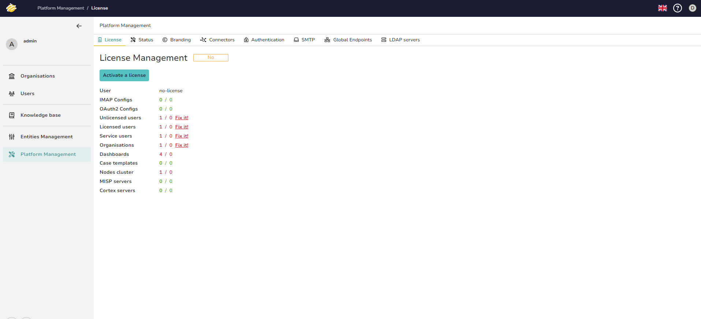<br><sub>Licence invalide dans l'UI TheHive</sub></td>
<td>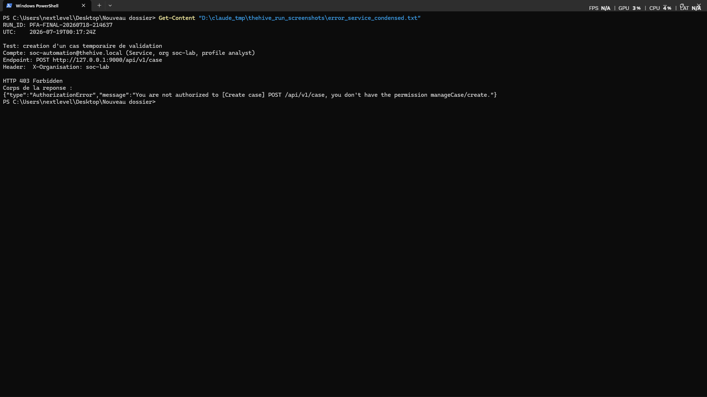<br><sub>403 manageCase/create — compte de service</sub></td>
</tr>
<tr>
<td>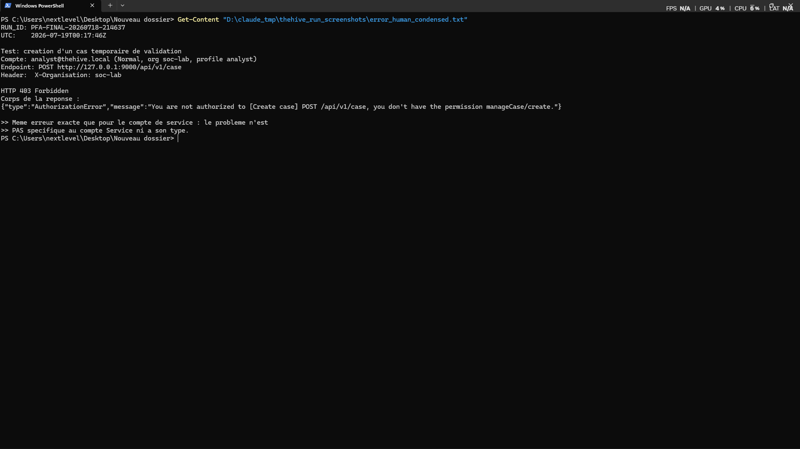<br><sub>403 manageCase/create — compte humain</sub></td>
<td>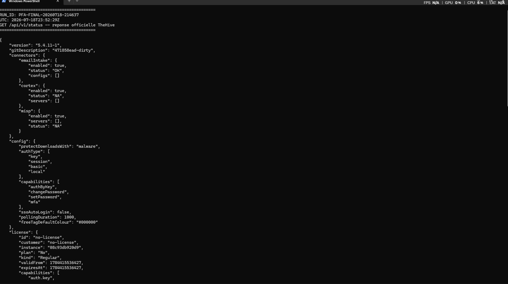<br><sub>GET /api/v1/status — license.isValid: false</sub></td>
</tr>
</table>

Investigation complète (11 captures, réponses API brutes, logs) :
[`thehive/license-investigation/THEHIVE_LICENSE_INVESTIGATION_EVIDENCE.md`](docs/evidence/final/PFA-FINAL-20260718-214637/thehive/license-investigation/THEHIVE_LICENSE_INVESTIGATION_EVIDENCE.md).
**Aucune action destructive** n'a été effectuée (aucun compte supprimé, aucune migration
lancée, aucune activation de licence tentée) ; l'instance reste archivée en lecture seule.

### 4.2 Instance `5.2.16-1` isolée : débloquée et opérationnelle

Le portail de licence StrangeBee s'étant révélé définitivement inaccessible, une instance
**TheHive 5.2.16-1** (version Community officielle antérieure au système de licence par
portail) a été déployée dans un environnement entièrement isolé — nouveaux conteneurs,
volumes, réseau, comptes. Aucun contournement de licence, aucun patch binaire.

<table>
<tr>
<td>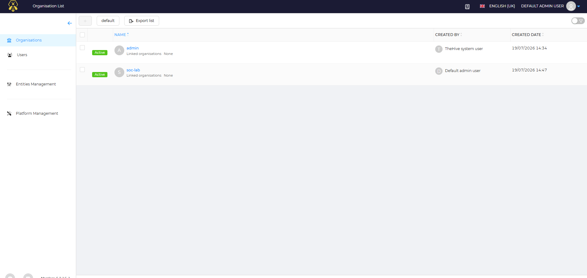<br><sub>Organisation soc-lab, version 5.2.16-1 confirmée</sub></td>
<td>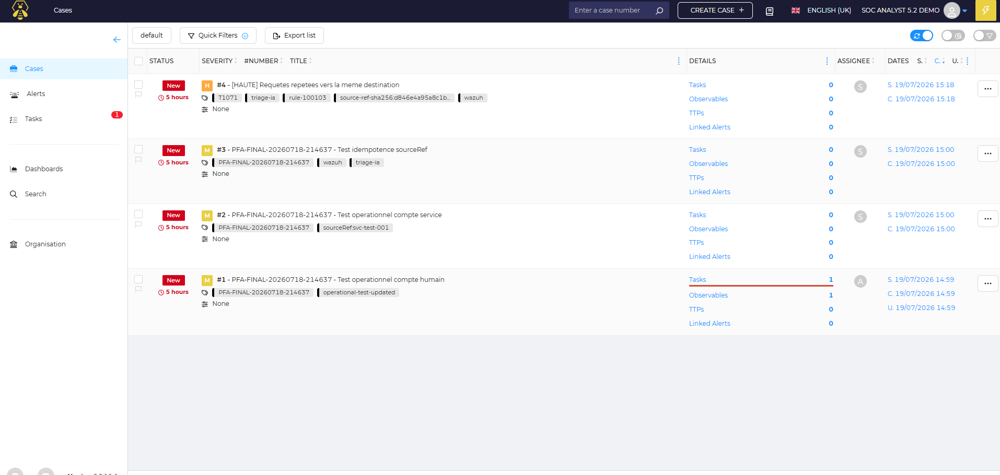<br><sub>Liste des cas réels créés</sub></td>
</tr>
<tr>
<td>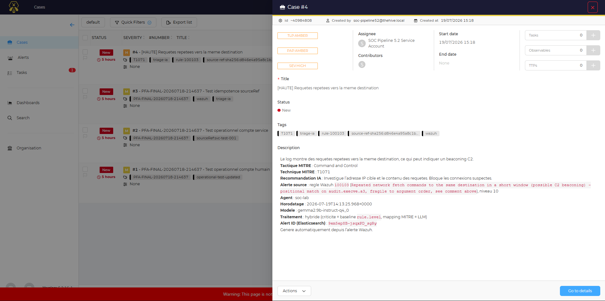<br><sub>Cas réel ~40984808 (pipeline complet)</sub></td>
<td>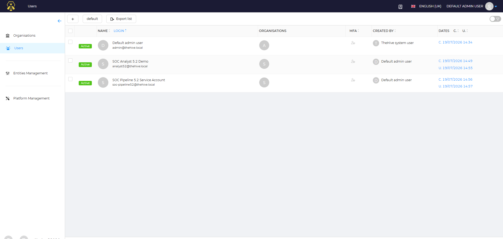<br><sub>Comptes humain + service, profil analyst</sub></td>
</tr>
</table>

**Incompatibilité API réelle découverte** : `Case.sourceRef` et `/api/v1/case/_search`
n'existent pas sur TheHive 5.2.16-1 (`AttributeCheckingError`, `404`). Corrigée par une
couche de compatibilité explicite `THEHIVE_DEDUP_MODE=tag` (tag déterministe
`source-ref-sha256:<hash>`), 17 tests ajoutés. Détail complet :
[`thehive52/API_COMPATIBILITY_FINDINGS.md`](docs/evidence/final/PFA-FINAL-20260718-214637/thehive52/API_COMPATIBILITY_FINDINGS.md).

**Test d'intégration réel de bout en bout** : alerte Wazuh réelle → triage Gemma2 réel → cas
TheHive réel `~40984808` créé → réexécution avec la même alerte → cas existant retrouvé,
**aucun doublon créé**. Preuve :
[`thehive52/raw/real_pipeline_integration_test_tag_mode.json`](docs/evidence/final/PFA-FINAL-20260718-214637/thehive52/raw/real_pipeline_integration_test_tag_mode.json).

## 5 — Cortex : enrichissement par analyzer

Cortex `3.1.9` testé avec un analyzer réel sur un observable du cas TheHive `~40984808`.

<table>
<tr>
<td>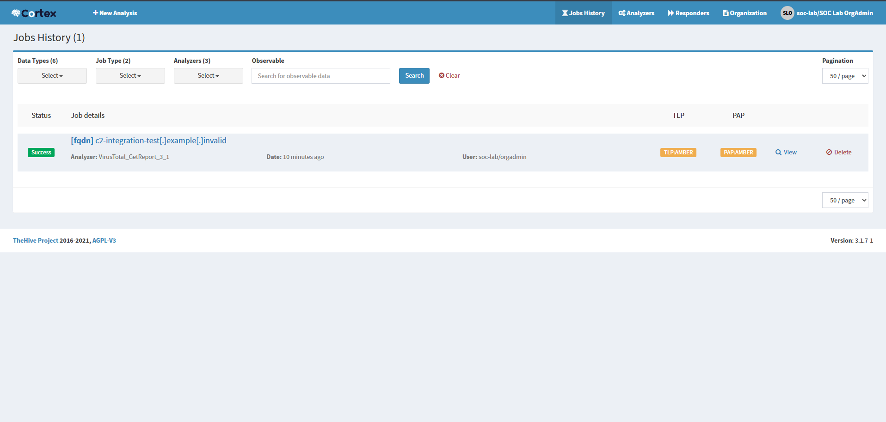<br><sub>Liste des jobs Cortex réels</sub></td>
<td>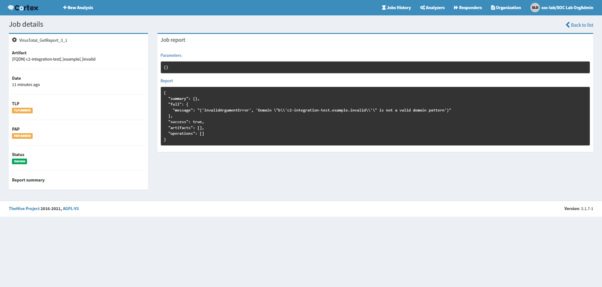<br><sub>Rapport détaillé du job</sub></td>
</tr>
<tr>
<td>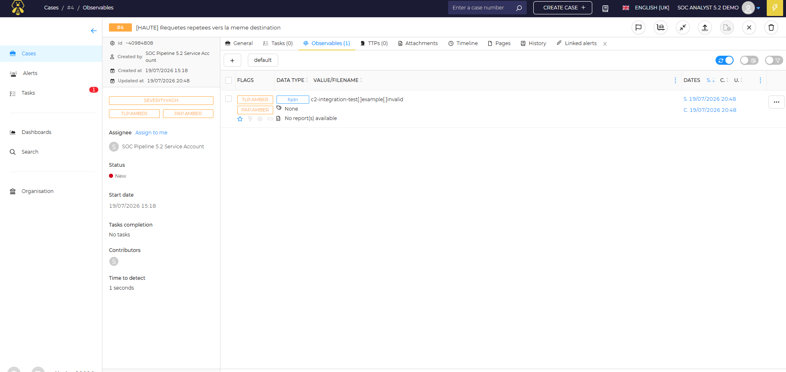<br><sub>Observable ajouté au cas ~40984808</sub></td>
<td>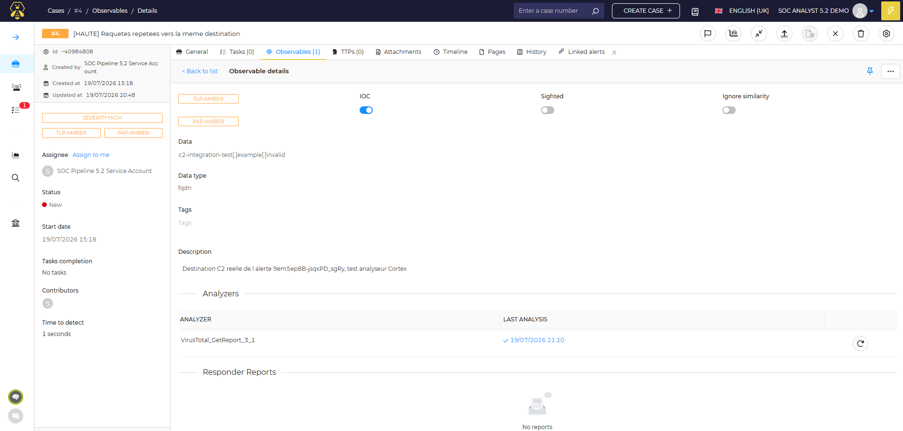<br><sub>Analyzer lié à l'observable</sub></td>
</tr>
</table>

Détail complet : [`cortex/CORTEX_ANALYZER_TEST.md`](docs/evidence/final/PFA-FINAL-20260718-214637/cortex/CORTEX_ANALYZER_TEST.md).

## 6 — MISP : partage de renseignement

MISP `2.5.42` déployé, événement réel `#5` créé via API, explicitement lié au cas TheHive
`~40984808` de ce run (attribut `text` référençant le cas, technique MITRE `T1071`, domaine
C2 synthétique `.invalid`).

<table>
<tr>
<td>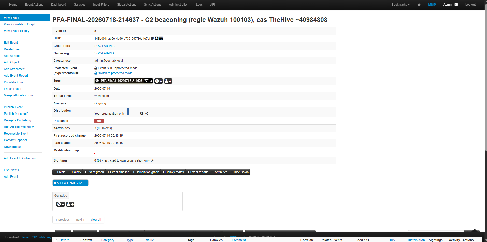<br><sub>Événement #5 — en-tête, UUID, tags</sub></td>
<td>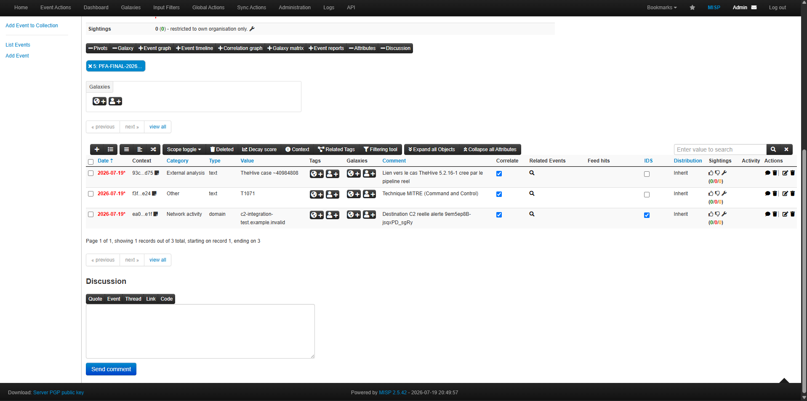<br><sub>3 attributs réels de l'événement</sub></td>
</tr>
</table>

Détail complet : [`misp/MISP_EVENT_TEST.md`](docs/evidence/final/PFA-FINAL-20260718-214637/misp/MISP_EVENT_TEST.md).
Événement publié (`Published: Yes`, vérifié via API) après contrôle préalable : 0 serveur de
synchronisation configuré sur cette instance MISP, distribution restée "Your organisation
only" — publication purement locale, aucune donnée n'a quitté le laboratoire.

## 7 — Shuffle : automatisation SOAR

3 workflows créés, chacun avec **au moins une exécution réelle complète** (`FINISHED`, réponse
HTTP 200 vérifiée) — pas de simulation, pas de `Test Action` isolé comme seule preuve.

| Workflow | Cible réelle | ID d'exécution réelle |
|---|---|---|
| Triage niveau 5-7 | Backend Shuffle (health check) | Voir capture ci-dessous |
| Notification TheHive | Cas TheHive `~40984808` | `ff44aa57-110f-4369-b49a-7754021deabc` |
| Enrichissement périodique MISP | Événement MISP `#5` | `43c6b4ea-5152-4199-ab23-b8ecd4ac4fcc` |

<table>
<tr>
<td>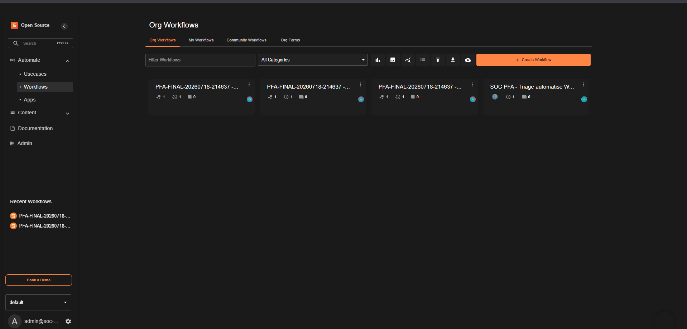<br><sub>Les 3 workflows dans Org Workflows</sub></td>
<td>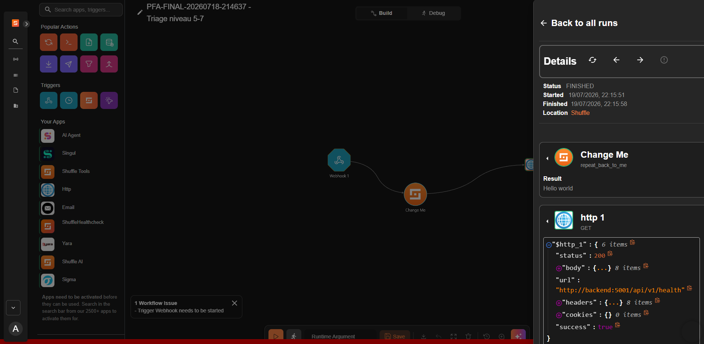<br><sub>Workflow 1 — exécution réelle, 200 OK</sub></td>
</tr>
<tr>
<td colspan="2">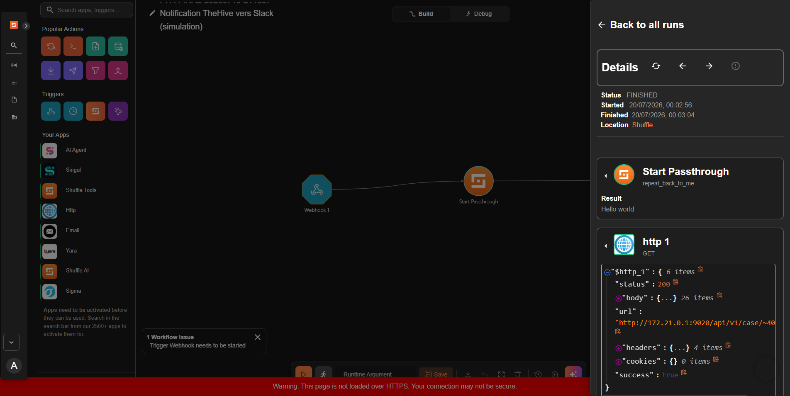<br><sub>Workflow 2 — Webhook → Start Passthrough → Http, appel réel vers le cas TheHive ~40984808, 200 OK</sub></td>
</tr>
</table>

**Deux bugs réels rencontrés et corrigés, documentés sans les masquer** :

1. **Bug UI Shuffle** : insérer un nœud HTTP sur une branche existante met à jour les
   `branches` côté serveur mais ne recalcule pas le champ `start` du workflow — le nœud inséré
   devient injoignable (`SKIPPED`). Corrigé sans appel API (pour ne jamais exposer le token
   TheHive/MISP dans une requête) : reconstruction du graphe par glisser-déposer ciblé, en
   respectant le `start` déjà correct plutôt qu'en le forçant.
2. **En-tête manquant (workflow 3)** : MISP redirigeait vers `/users/login` (flux HTML) sans
   l'en-tête `Accept: application/json`. Identifié, corrigé, ré-exécuté avec succès.

Détail complet, chronologie des deux bugs, tentatives de correction et preuves :
[`shuffle/SHUFFLE_WORKFLOWS.md`](docs/evidence/final/PFA-FINAL-20260718-214637/shuffle/SHUFFLE_WORKFLOWS.md).

## 8 — Dashboard SOC

4 indicateurs (Wazuh/OpenSearch Dashboards), retrouvés intacts d'une itération précédente
(toujours branchés sur l'index `wazuh-alerts-*` vivant), revérifiés avec les données de ce
run et recoupés indépendamment par requêtes OpenSearch brutes :

| Indicateur | Valeur observée (30 jours) |
|---|---|
| Total incidents | 289 027 → 290 569 (deux mesures, flux continu réel) |
| Répartition par type (top 10) | Dominée par les alertes `Audit: Command` |
| Répartition par criticité | 10 niveaux `rule.level` distincts |
| Techniques MITRE ATT&CK | 18 techniques distinctes, `T1071` confirmé à 2 466 occurrences (cohérent avec le scénario C2 beaconing de ce run) |

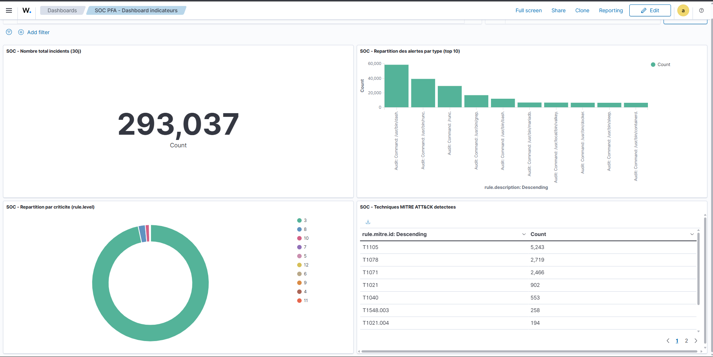<br><sub>Export PNG natif du tableau de bord complet (Reporting → Download PNG)</sub>

Détail complet : [`dashboard/DASHBOARD.md`](docs/evidence/final/PFA-FINAL-20260718-214637/dashboard/DASHBOARD.md).

## 9 — Dataset final et évaluation

Jeu de données labellisé construit par **identifiant d'alerte exact** (pas par fenêtre
temporelle, pour éviter la contamination par bruit résiduel documentée pour l'ancienne
méthode), couvrant les 6 alertes réelles de ce run. Comparaison à trois voies : référence
MITRE établie manuellement, baseline native Wazuh (`rule.mitre`), prédiction Gemma2 9B
(réutilisée telle quelle depuis la Phase 4, aucun nouvel appel LLM).

| Métrique | Résultat |
|---|---|
| Correspondance exacte du code technique MITRE (Gemma vs référence) | **6/6 (100 %)** |
| Correspondance du libellé de tactique | 5/6 (83,3 %) — 1 écart honnête (voir Section 3) |
| Couverture MITRE native de Wazuh seul (`rule.mitre`) | **0/6 (0 %)** |
| Durée moyenne d'inférence Gemma2 9B | 117,9 s/alerte |

Sans le triage LLM, ces 6 alertes réelles n'auraient **aucune** technique MITRE associée
automatiquement — la baseline Wazuh native est structurellement vide pour les règles
personnalisées de ce laboratoire. Détail complet, méthodologie, table de correspondance
scénario par scénario : [`evaluation/EVALUATION.md`](docs/evidence/final/PFA-FINAL-20260718-214637/evaluation/EVALUATION.md) ·
[`evaluation/DATASET_FINAL.json`](docs/evidence/final/PFA-FINAL-20260718-214637/evaluation/DATASET_FINAL.json).

## Chaîne de preuve de bout en bout

Le scénario C2 beaconing relie 5 des 6 preuves majeures de ce run autour d'un seul
identifiant, le cas TheHive `~40984808` :

```
Alerte Wazuh réelle (règle 100103)
        │  raw/scenario5_c2_beaconing_alert_VNRCd58BPpYiiypp8OU5.json
        ▼
Triage Gemma2 9B → Command and Control / T1071
        │  gemma/scenario5_c2_beaconing_gemma_validated_result.json
        ▼
Cas TheHive ~40984808 (déduplication par tag vérifiée, pas de doublon)
        │  thehive52/raw/real_pipeline_integration_test_tag_mode.json
        ├──► Workflow Shuffle 2 : appel HTTP réel vers le cas ~40984808 (200 OK)
        │       shuffle/raw/workflow2_real_execution.json
        ▼
Événement MISP #5 (tag explicite "cas TheHive ~40984808")
        │  misp/MISP_EVENT_TEST.md
        ├──► Workflow Shuffle 3 : appel HTTP réel vers l'événement MISP #5 (200 OK)
        │       shuffle/raw/workflow3_real_execution.json
        ▼
Dashboard SOC : T1071 visible dans le tableau MITRE (2 466 occurrences réelles/30j)
        dashboard/raw_verification_opensearch_aggregations.json
```

## Bugs réels rencontrés et corrigés (récapitulatif)

| Bug | Composant | Résolution |
|---|---|---|
| Blocage SSH VM | Infrastructure | Identifiants locaux retrouvés |
| Licence TheHive invalide | TheHive 5.4.11-1 | Instance 5.2.16-1 isolée déployée |
| `sourceRef`/`_search` absents | TheHive 5.2.16-1 | Mode `THEHIVE_DEDUP_MODE=tag`, 17 tests |
| Champ `start` non recalculé | Shuffle | Reconstruction du graphe sans appel API |
| En-tête `Accept` manquant | Shuffle → MISP | En-tête ajouté, ré-exécution réussie |
| Export capture d'écran bloqué | Outillage générique de capture (dashboard) | Fonctionnalité native "Reporting → Download PNG" utilisée à la place, export réel obtenu |
| Événement MISP non publié | Prudence excessive initiale | Vérifié 0 serveur de sync configuré, publié sans risque |

## Principes de cette validation

- Aucune alerte, résultat, identifiant ou capture n'est fabriqué. Quand un accès manque ou un
  outil échoue, l'étape est signalée bloquée avec la commande exacte tentée et l'erreur reçue.
- Simulations offensives réalisées en environnement isolé et contrôlé (domaines `.invalid`,
  `localhost`, sous-réseau privé du laboratoire uniquement).
- Chaque fichier de preuve est hashé en SHA-256 —
  [`SHA256SUMS_ALL.csv`](docs/evidence/final/PFA-FINAL-20260718-214637/SHA256SUMS_ALL.csv)
  (manifeste complet, 100 fichiers).
- Les captures d'écran sont vérifiées visuellement (contenu recoupé contre les réponses API
  brutes) avant d'être citées comme preuve.

## Historique

Le projet a été initialement développé de juillet à mi-juillet 2026 (voir
[`docs/evidence/archive-pre-final/`](docs/evidence/archive-pre-final/README.md)). Une revue
externe a identifié des limites méthodologiques (contamination de dataset, doublons dans le
holdout, règle de corrélation buguée, preuves incomplètes) qui ont motivé la reprise complète
documentée dans ce README, avec le `RUN_ID PFA-FINAL-20260718-214637` et une exigence de
traçabilité et de vérification live beaucoup plus stricte.

## Structure du dépôt

```
scripts/                            Pipeline Python (Wazuh -> Gemma -> TheHive), règles Wazuh, tests
tests/                               Tests unitaires et d'intégration (pytest)
docs/evaluation/                     Datasets et résultats d'évaluation LLM vs baseline (itération précédente)
docs/evidence/final/PFA-FINAL-20260718-214637/   Preuves complètes de ce run, phase par phase
docs/evidence/archive-pre-final/     Version archivée pré-reprise (ne pas citer comme état actuel)
docker/                              Compose files TheHive, Cortex
```

## Statut des tests et CI

58+ tests (unitaires + intégration avec Wazuh/Ollama/TheHive mockés), Ruff, Gitleaks — voir
le workflow GitHub Actions (statut vert sur chaque commit de ce run). Ces tests valident le
code du pipeline ; ils ne remplacent pas la validation réelle sur la VM documentée ci-dessus.
